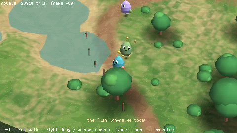
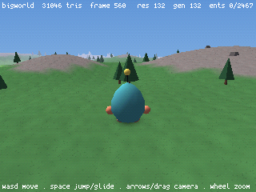
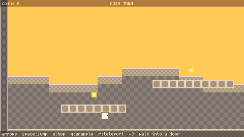

# cosmic2d

A tiny 2D pixel-art engine / fantasy console — with an optional retro-3D
pipeline (N64-era 3D and Ragnarok-Online-style 2.5D, merged back from the
cosmic3d fork; see `docs/COSMIC3D.md`). Deterministic to the bit, rewindable
like an emulator, batteries included, and everything — code, art, maps,
audio — is authored inside the shipped editor while the game runs.

<p align="center">
  
</p>
<p align="center">
  
  
</p>

The intended distribution is one folder containing the engine, editor, tools,
and game projects. The source checkout is built with Nix and the
extract-and-run archives are clean-machine tested; the editor can export any
opened project with its carried runtime. Nightly builds publish from CI as
prerelease archives (see the repository's Releases page).

**Status: alpha candidate.** The engine, infinite-canvas editor (2D and 3D
authoring), audio stack, rewind/replay product, gamepad + player settings,
project lifecycle/export, and the bundled demo matrix are all here, and the
deterministic suite is green. What remains before "alpha" is the
release-candidate validation itself — the fresh-user pass and the executed
release checklist; see `docs/ALPHA.md` (gate A8), `docs/CHANGELOG.md`, and
`docs/KNOWN-LIMITATIONS.md`.

## Try it

Grab the latest **nightly** archive from the Releases page (Linux `.tar.gz`
or Windows `.zip`, each with a sibling `.sha256`) — extract and run
`cosmic2d-editor`. Or build from source on Linux/WSL2 with
[Nix](https://nixos.org):

```sh
nix develop -c make -C pal     # build bin/cosmic
bin/cosmic                     # the project picker — the front door
```

The picker lists bundled and recent projects. Open the bundled **demo** (a
two-room platformer with music that swaps between rooms), press **+ New
project** to scaffold your own, or choose **open folder** to register an
existing project wherever it already lives. A tile opens a project in the
editor; the ▶ zone plays it. Missing recent folders remain visible with
**repair** and **remove** actions, and the editor's **← projects** button
returns to this list after safely saving its recovery state. A ready recent
tile's **...** menu reveals its folder or renames/moves it without overwriting
an existing destination; move chooses a new parent on the same filesystem.

```sh
bin/cosmic projects/demo            # play the demo directly
bin/cosmic projects/demo --edit     # open it in the editor
```

The editor release bundles (`nix build .#cosmic` / `.#cosmic-windows`) contain
only the intentional demo and picker; `.#cosmic-dev` and
`.#cosmic-windows-dev` additionally carry internal tests and fixtures. Editor
bundles drop two launchers in their **root**:

- **`cosmic2d-editor`** (`.exe`) — the project picker / editor front door.
- **`demo`** (`.exe`) — the bundled demo, straight to play.

Windows `.exe` launchers use the GUI subsystem, so opening them normally does
not create a second console window. For diagnostics, automation, and headless
runs, use `bin/cosmic-console.exe`; it is the same engine with stdout/stderr
attached to the calling terminal.

Download-shaped editor archives (plus sibling integrity hashes) build with:

```sh
nix build .#cosmic-linux-release     # result/cosmic2d-linux.tar.gz + .sha256
nix build .#cosmic-windows-release   # result/cosmic2d-windows.zip + .sha256
```

Live runs also keep a flushed process log outside the extracted engine folder,
so diagnostics still work from a read-only install and from GUI launchers. The
platform-selected folder is `%APPDATA%\cosmic2d\engine\diagnostics\` on
Windows and `$XDG_DATA_HOME/cosmic2d/engine/diagnostics/` on Linux (falling
back to `~/.local/share/cosmic2d/engine/diagnostics/`). Contained errors add an
atomic `.ccrash` report there; it includes the traceback and exact retained-
history locator. Capped captures and verification runs do not create logs.

## Make a game

Everything is authored in the editor (`--edit`, or via the picker): an
infinite canvas of floating windows. Spawn windows from the right-click
menu — a **code editor**, a **sprite editor** (+ animation), a **map editor**
(collider chains, one-ways, markers) and **tilemaps**, a **sound player**, a
**synth** (FM + Game Boy voices with filter/pitch-sweep), a **music** tracker,
and a **palette** designer. New assets and projects auto-name themselves with
three random words, so nothing blocks on a filename.

The game itself is hot-reloadable Lua: edit `main.lua` while it runs. See
`projects/demo/` for a complete, commented example — the moveset, two rooms,
sound effects, and two 30-second BGMs.

## Ship a game

From the editor, open **project settings → build/export**. Choose the output
folder and this download's matching target (Linux `.tar.gz` from Linux,
Windows `.zip` from Windows), then press **build export**. The job refuses
unsaved editor assets or incomplete player metadata, shows per-file progress,
cancels without publication, and atomically publishes a completed archive plus
its sibling `.sha256`. Use the matching editor download for the other platform.

The Nix developer packager remains useful for release automation:

```sh
nix run .#package -- demo          # -> demo-windows.zip + .sha256
nix run .#package -- demo linux    # -> demo-linux.tar.gz + .sha256
```

The archive root is player-facing: run **`demo`** / **`demo.exe`** there. Its
README is generated from the project's title, version, description, controls,
credits, and license metadata, and `icon.png` is the project's release icon.
The Windows root launcher carries that project title/version/icon in Explorer;
the live game window uses the same icon on both platforms. The selected
editable project and engine/editor tooling remain included, with
`bin/cosmic2d-editor` available as a deliberate authoring entrance.

A packaged project supplies these plain-data fields in `project.lua`:

```lua
icon = "icon.png",             -- square PNG, 32..1024 px
controls = "CONTROLS.md",
credits = "CREDITS.md",
licenses = { "LICENSE.md" },   -- one or more project-local files
```

All references are jailed forward-slash paths within the project and packaging
fails before publication if metadata or a referenced file is invalid. The
bundle also contains the engine/runtime notices, a complete extracted-tree
`SHA256SUMS`, and the exact carried runtime-library inventory. Verify the
archive's sibling checksum before extraction and run `sha256sum --check
SHA256SUMS` from inside the extracted folder afterward. The Nix command builds
projects captured in the source tree; the in-editor path packages the currently
open project from any folder without Nix, `tar`, or `zip`.

Alpha artifacts are deliberately unsigned: checksums detect changed bytes but
do not prove publisher identity. Windows may report an unknown publisher. Do
not bypass platform warnings for an artifact whose source you do not trust;
the full verification and future-signing policy is in
[`THIRD_PARTY_NOTICES.md`](THIRD_PARTY_NOTICES.md).

## Shape of the thing

- **Two layers**: a small per-platform C binary ("PAL": SDL3 + Vulkan via
  SDL_GPU, embedded Lua 5.4, typed memory buffers, a frame-locked FM/sampler
  audio synth) under a fully hot-reloadable Lua engine — game code, physics,
  the editor, and all tools are Lua you can edit while the game runs.
- **Deterministic to the bit**: fixed 60 Hz sim, snapshot/rewind any frame
  (emulator-style), input-trace regression tests against state + pixel + PCM
  goldens on a pinned software Vulkan driver.
- **Batteries included**: a platformer moveset, sprite/animation + map +
  tilemap editors, an FM/Game-Boy synth and a music tracker with stock
  instruments and sound effects, a palette designer with stock palettes, and
  a demo game to start from.

Deep dives live in `docs/` — `PLAN.md` (vision), `ARCHITECTURE.md` (the
two-layer design + determinism rules), `EDITOR.md`, `AUDIO.md`, `MAPS.md`.

## Platforms

Development builds run on Linux and Windows desktop; the Windows binary is a
cross-build. Portable editor and play archives are clean-machine tested on a
stock x86_64 Debian 13 container and native Windows 11. macOS is not supported
for this alpha.

## License

MIT — see [LICENSE](LICENSE). Vendored third-party code keeps its own
(compatible) licenses. Packaged builds reproduce their exact notices plus the
selected platform runtime notices under `LICENSES/`; see
[`THIRD_PARTY_NOTICES.md`](THIRD_PARTY_NOTICES.md).
