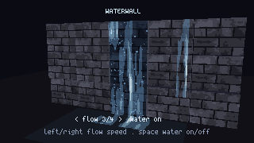
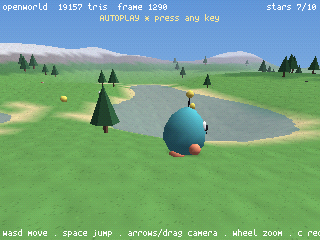
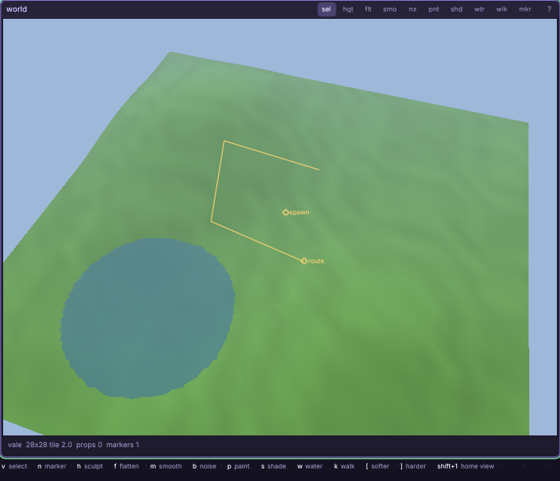
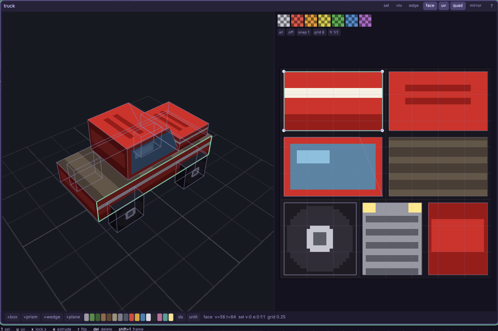
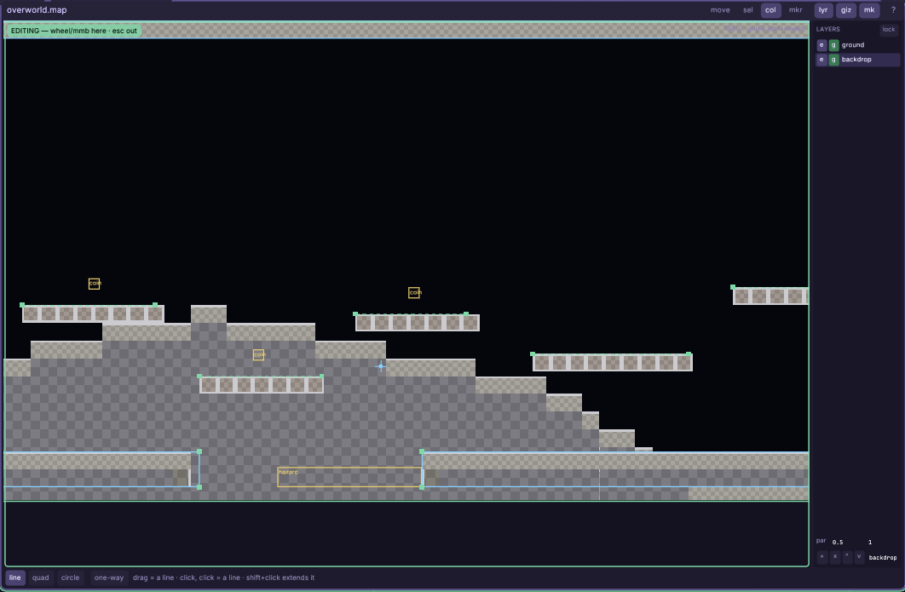
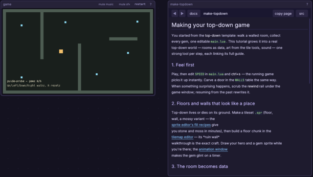

# cosmic2d

[](https://github.com/Francesco149/cosmic2d/actions/workflows/nightly.yml)

**cosmic2d is a batteries-included game engine and fantasy-console-shaped
studio for pixel-art 2D and retro 3D.** Its core
philosophy is simple: the simulation is deterministic, everything is
rewindable, everything hot reloads, and every authoring tool lives on one
infinite canvas. Extract one folder and draw, code, compose, play, inspect any
past frame, and export a game without assembling a toolchain.

> [!WARNING]
> cosmic2d is an early-stage experimental project, currently an **alpha
> candidate**. Until the project is explicitly past alpha, stability is not
> guaranteed: APIs, file formats, editor sessions, save data, behavior, and
> backwards compatibility may all break. Keep backups and expect sharp edges.

## The current showcase

<table>
  <tr>
    <td width="50%" align="center">
      <br>
      <sub><strong>rovale</strong> — click-to-move sprite characters in a
      painted RO-style 2.5D world</sub>
    </td>
    <td width="50%" align="center">
      <br>
      <sub><strong>waterwall</strong> — animated textures: a translucent
      water overlay flowing over a UV-mapped rock wall</sub>
    </td>
  </tr>
  <tr>
    <td width="50%" align="center">
      <br>
      <sub><strong>openworld</strong> — the streaming-world laboratory: lakes,
      rolling terrain, NPCs, swimming, and a glider-scale draw distance</sub>
    </td>
    <td width="50%" align="center">
      <br>
      <sub><strong>demo</strong> — the bundled two-room platformer: movement,
      collisions, animation, effects, camera, music, and room transitions in a
      small readable project</sub>
    </td>
  </tr>
</table>

cosmic2d started as a 2D engine; 2D, N64-era 3D, and RO-style 2.5D are now
first-class engine and editor paths. **rovale** and **bigworld** (unpictured —
**openworld** above shares its N64-style aesthetic) are currently the most
developed showcase demos. The compact 2D project remains the clearest
place to learn the engine's moving parts. All of them share the same
deterministic simulation, rewind timeline, hot-reload model, and canvas tools.

## What is already in the box

| Principle | Working surface |
|---|---|
| **Batteries included** | Blank, platformer, top-down, arcade, and 3D-vale starters; actor/world helpers; swept collision, slopes, one-ways, triggers and queries; cameras, animation, particles, tweening, hit pause, dialogue, HUDs, menus, and player saves. |
| **Deterministic** | A fixed 60 Hz simulation, stable IDs and iteration, deterministic keyboard/mouse/gamepad input, frame-locked synthesis, and regression traces checked against state, pixel, and PCM goldens on a pinned software Vulkan stack. |
| **Everything is rewindable** | Scrub the live game to any retained frame, inspect it, resume from it, export self-contained trace clips, and use crash reports as exact history-stream/frame entry points. Editor work has a persistent journal and long-lived undo history too. |
| **Everything hot reloads** | Lua gameplay, engine modules, tools, art, maps, and audio stay editable while the game is running; contained errors preserve the last good world instead of turning a typo into a restart loop. |
| **Infinite canvas** | Game views, code, console, help, sprite/animation, maps/tilemaps, palette, synth, tracker, timeline, project settings, and 3D tools are movable windows on one zoomable spatial desk. The same intent grammar handles moving, grouping, resizing, cycling, and closing them. |
| **One-folder shipping** | The picker creates/imports/duplicates/moves/archives projects; in-editor Build/Export validates metadata, shows progress, can cancel safely, and atomically publishes a portable game plus checksums. Exported games remain inspectable projects with the editor deliberately carried inside. |

The runtime also includes rebindable keyboard and hot-plugged gamepad actions,
per-player options, versioned atomic save profiles, pixel-perfect rendering,
palettes and grading, parallax/depth helpers, and a diagnostics path that still
works from read-only installs and Windows GUI launchers.

## The tools are the engine

<table>
  <tr>
    <td width="50%" align="center">
      <br>
      <sub><strong>Music tracker</strong> — piano roll, patterns, live preview,
      per-track level and stereo pan, plus reusable stock songs</sub>
    </td>
    <td width="50%" align="center">
      <br>
      <sub><strong>Terrain editor</strong> — the 3D starter's vale in the 3D
      map window: sculpt, paint, shade, water, walkability, and route
      markers directly in the world</sub>
    </td>
  </tr>
  <tr>
    <td width="50%" align="center">
      <br>
      <sub><strong>Mesh editor</strong> — picoCAD-style UV mapping, one face
      at a time: the vehicle demo's truck over its livery sheet, with stock
      checkers and per-vertex islands</sub>
    </td>
    <td width="50%" align="center">
      <br>
      <sub><strong>Map editor</strong> — platforms as collider chains drawn
      over the tile art: lines, one-ways, hazards, and markers the game
      reads</sub>
    </td>
  </tr>
  <tr>
    <td width="50%" align="center">
      <br>
      <sub><strong>Sprite studio</strong> — pixels, animation, selections,
      transforms, and deterministic procedural fills</sub>
    </td>
    <td width="50%" align="center">
      <br>
      <sub><strong>Living tutorials</strong> — runnable starters and their docs
      open together on the same infinite canvas</sub>
    </td>
  </tr>
</table>

Audio is generated inside the same workflow: a deterministic four-operator FM
and Game-Boy-flavored synth, filters and pitch sweeps, sound playback, a stereo
tracker, stock instruments/effects, and fourteen arranged stock songs. The
3D path adds a Vulkan raster pipeline, projected terrain and water,
billboard figures, world streaming, figure baking, UV-textured low-poly
meshes with animated texture frames, and map/terrain authoring;
the software renderer remains the deterministic reference.

## Try it

Download the latest Linux `.tar.gz` or Windows `.zip` from
**[Releases](https://github.com/Francesco149/cosmic2d/releases)**, verify its
sibling `.sha256`, extract it, and run `cosmic2d-editor` (`.exe` on Windows).
Nightlies are moving prereleases; release candidates are versioned prereleases.

Or build from source on Linux/WSL2 with [Nix](https://nixos.org):

```sh
nix develop -c make -C pal     # build bin/cosmic
bin/cosmic                     # open the project picker
bin/cosmic projects/demo       # play the 2D demo directly
bin/cosmic projects/demo --edit
```

The picker is the front door. Open the bundled demo, create a project from one
of the five starters, or register any existing project folder in place. Recent
projects are searchable and keyboard-drivable; missing folders can be repaired
or removed, and ready projects can be revealed, renamed, moved, duplicated,
archived, or deleted through recovery-aware flows.

Release editor bundles contain only the intentional picker and playable demo;
developer bundles additionally carry internal fixtures and proofs. Their root
launchers are:

- `cosmic2d-editor` / `cosmic2d-editor.exe` — picker and editor.
- `demo` / `demo.exe` — the bundled game, directly in play mode.
- `bin/cosmic-console.exe` — the same Windows engine with a terminal attached
  for diagnostics, automation, and headless runs.

## Make and ship a game

Game code is ordinary hot-reloadable Lua. Open **+ New project**, pick a
starter, and keep its running game beside its source and tools. The bundled
`projects/demo/` is a compact commented example with two rooms, a complete
moveset, effects, sound effects, and room-specific music.

To ship without a developer environment, open **project settings →
Build/Export**. The editor refuses unsaved assets or incomplete metadata,
streams per-file progress, cancels without partial publication, and writes the
archive and checksum atomically. Use the matching editor download to export
for that platform.

Release-shaped editor archives can also be built from the checkout:

```sh
nix build .#cosmic-linux-release     # .tar.gz + sibling .sha256
nix build .#cosmic-windows-release   # .zip + sibling .sha256
```

And the developer packager can turn a source-tree project into a player-facing
archive:

```sh
nix run .#package -- demo          # demo-windows.zip + .sha256
nix run .#package -- demo linux    # demo-linux.tar.gz + .sha256
```

The project declares its title, version, icon, controls, credits, license, and
save identity in plain data. Packaging validates every reference, carries the
matching runtime and notices, generates the player README, and includes a full
extracted-tree `SHA256SUMS`. Alpha artifacts are deliberately unsigned:
checksums detect changed bytes, but do not establish publisher identity. See
[`THIRD_PARTY_NOTICES.md`](THIRD_PARTY_NOTICES.md) for the verification and
future-signing policy.

## Technical shape

cosmic2d has two layers:

- A small platform layer in C: SDL3, Vulkan through SDL_GPU, embedded Lua 5.4,
  typed buffers, image/audio codecs, input, filesystem primitives, and the
  frame-locked synth.
- A hot-reloadable Lua engine: simulation, physics, rendering policy, editor,
  tools, project lifecycle, rewind, tests, and games.

This split keeps platform variance outside recorded state. The simulation owns
only serializable data and crosses explicit doors for live input, disk reads,
and wall-clock effects, which is what makes rewind, replay, cross-platform
verification, and useful crash capture part of the product instead of debug
afterthoughts.

Start with [`docs/README.md`](docs/README.md), then see
[`docs/ALPHA.md`](docs/ALPHA.md) for the active release gates,
[`docs/ARCHITECTURE.md`](docs/ARCHITECTURE.md) for the determinism contract,
[`docs/EDITOR.md`](docs/EDITOR.md), [`docs/AUDIO.md`](docs/AUDIO.md),
[`docs/REWIND.md`](docs/REWIND.md), and
[`docs/COSMIC3D.md`](docs/COSMIC3D.md).

## Platforms and license

Development and portable builds target x86_64 Linux and Windows desktop. The
Windows binary is cross-built and native-tested; the Linux archive is tested
from a clean Debian container without a Nix-store dependency. macOS, mobile,
web, and consoles are not supported at this stage.

MIT — see [LICENSE](LICENSE). Vendored dependencies keep their compatible
licenses, and packaged builds reproduce their exact notices under `LICENSES/`.

Maintainers can cut the next annotated candidate tag after pushing `main` with
`tools/tag-release-candidate.sh --push`; the tag starts the candidate build and
prerelease workflow. The complete human gate is in
[`docs/RELEASE-CHECKLIST.md`](docs/RELEASE-CHECKLIST.md).
