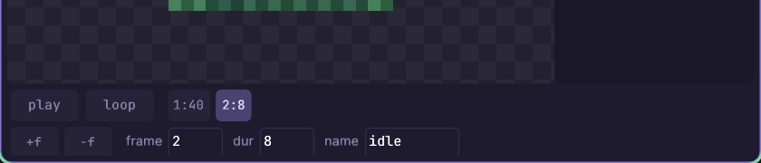
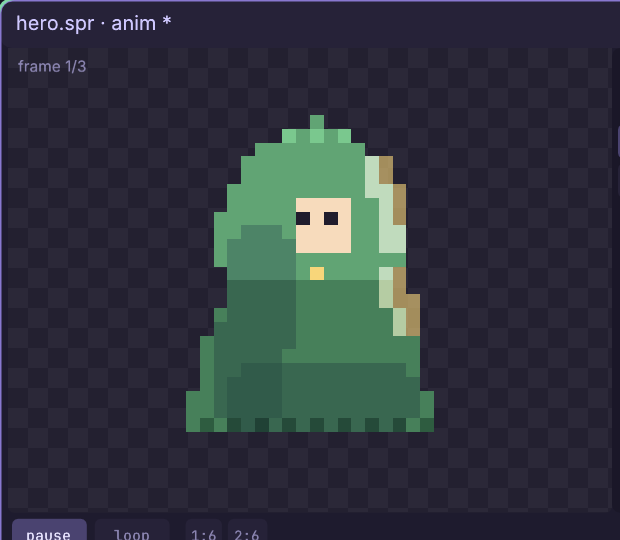
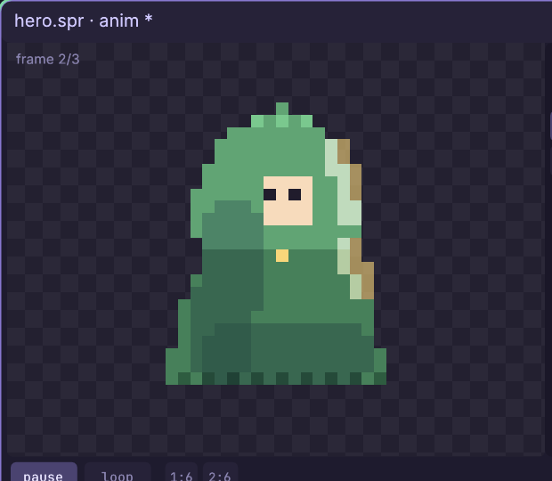
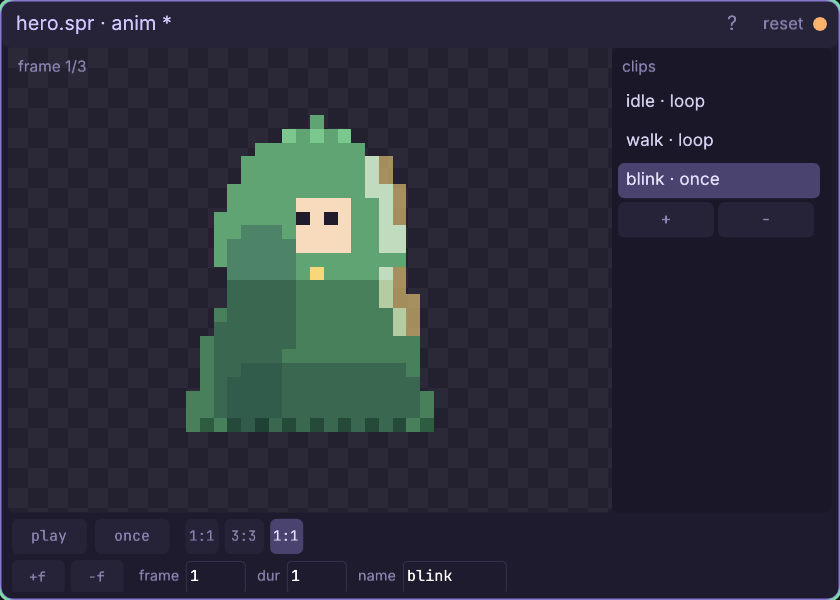

# The animation window

Cut a sprite's frame strip into named **clips** the game plays — idle,
walk, blink — with per-frame durations, loop modes, and a live preview.

Every knob and button: [the animation reference](engine/stock/docs/ref-anim.md) —
the preview, the clip rail, the transport, every field and hotkey.

## Walkthrough: bring the hero to life

One sitting, from the sprite tutorial's three-frame hero to a character
that breathes, marches and blinks — and a `.anim` file your game code
plays. The lesson underneath: with frames this cheap,
**timing does most of the acting**. Uneven durations make an idle
read as breathing; the same two drawings at even tempo read as a
march.

You need `art/hero.spr` from
[the sprite tutorial](engine/stock/docs/win-sprite.md) — a 32x32 hero
whose frames 2 and 3 are still byte-copies of frame 1. (Any sprite
with a face and a strip works; positions below are the hero's, read
off the canvas's `x,y` readout.)

1. Open the hero in a sprite window (if it is not still open:
   right-click empty canvas, pick **sprite**, type `art/hero.spr`,
   enter, **open**) and make sure you are in **edit** mode. Click
   **anim** in the header: the animation window opens beside it,
   already bound. With no clips defined it cycles the whole strip —
   three identical heroes, so nothing appears to move. The `frame N/3`
   readout in the preview's corner is the only tell.
2. First, make frames 2 and 3 worth playing — back in the sprite
   window. On the layers rail click the **bottom row** of the stack
   (layer 1, the body — paint must land under the shadow and light
   layers), then press **p** for the pen and set the brush strip to
   size **1**, op **100%**.
3. Frame 2 becomes the **breathe** frame: click frame chip **2**.
   Press **k** and click the cloak at (18,15) — the pick tool samples
   the body green as your primary. Press **p** and dab (16,15): the
   gold clasp vanishes under body color. Now left-click the
   **gold swatch** (the 14th color) and dab (16,16). The clasp sits a
   pixel
   lower — the chest falls as the hero exhales. That single pixel is
   the whole animation.
4. Frame 3 becomes the **blink** frame: click frame chip **3**,
   left-click the light **skin swatch** (the 7th color), and dab both
   eyes — (15,11) and (17,11). Eyes shut.
5. Focus the animation window again — the preview now flickers
   through exhale and blink at a mechanical 8 ticks each. Watchable,
   but it has no intent yet. Clips give it intent.
6. Click **+** on the clip rail: `clip1 · loop` appears with one entry
   chip in the transport row. In the **name** field type `idle` and
   press enter — the rail row now reads `idle · loop`.
7. Click the entry chip: the preview pauses on its frame and the
   fields select it. Set **frame** to `1`, **dur** to `40` (enter
   commits each). Click **+f** — a second entry appears — and set it
   to frame `2`, dur `8`. The chips read `1:40 2:8`.

8. Press **space**. The hero breathes: a long held base, a short
   exhale, forever. The uneven split is the trick — 40:8 reads as
   breathing where 24:24 would read as a metronome.
9. **+** again, name it `walk`, and give it the same two frames at
   even tempo: first entry frame `1` dur `6`, **+f**, frame `2` dur
   `6`. Press **space** — the clasp pumps at three steps a second and
   the same two drawings now read as a determined little march.
   Timing alone changed the meaning.

10. One more: **+**, name it `blink`, entries `1:1`, then **+f** frame
   `3` dur `3`, then **+f** frame `1` dur `1`. Click the **loop chip**
   (or press **l**) so it reads **once**: the clip plays through and
   holds its final frame. A blink is not a loop — game code fires it
   on a random timer over the idle, which is why the open-eyed
   bookend entries matter.

11. Tour your work: click each rail row and **space** through it;
   click any entry chip to pause and scrub. Then **ctrl+s** — the
   same save as the sprite window. Beside the baked `.png` strip you
   now have `art/hero.anim`, the clip table games read.

## In the game

The runtime is three lines — load the sidecar once, pick a frame from
the sim clock each step:

    local anim = cm.require("cm.anim")
    local clips = anim.load(cm.main.args.project .. "/art/hero.anim")
    local walk = anim.find(clips, "walk")
    -- in game.step / game.draw:
    local frame = walk and anim.frame_at(walk, state.frame()) or 0

`frame` is a 0-based strip column for `gfx.sprite`; `state.frame()` is
the deterministic sim clock, so the march is bit-identical under
replay. Play `blink` by evaluating it against its own start tick when
a random timer fires, and fall back to `idle` when
`anim.frame_at` holds the last frame past
`anim.duration(blink)` ticks.

Full reference: [every control in this window](engine/stock/docs/ref-anim.md),
[the sprite editor](engine/stock/docs/win-sprite.md), and
[animation in game code](engine/stock/docs/scripting.md#animation-clips-and-sprites-cmanim-cmsprite).
