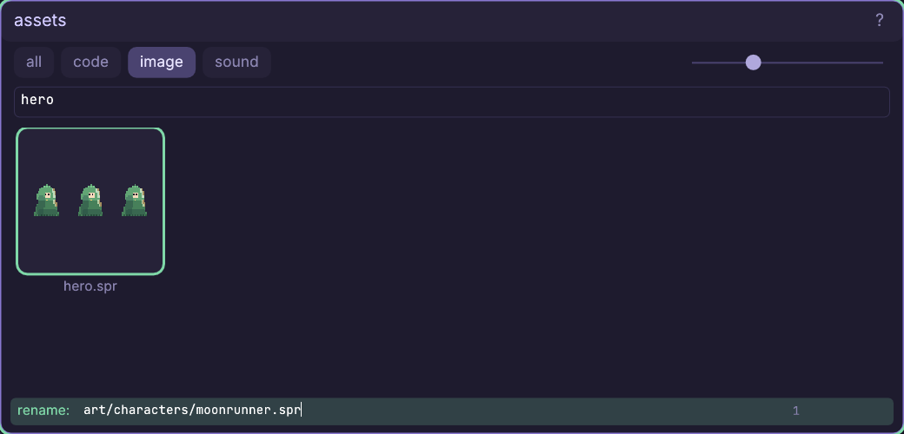
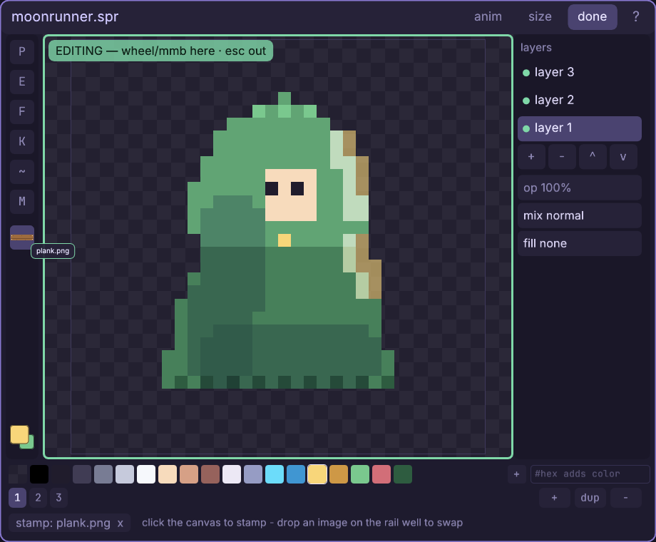

# The assets browser

Turn a loose project into a kit you can understand at a glance: find by role,
move whole editable families, and carry files to the windows that use them.

Every control and edge case: [the assets reference](engine/stock/docs/ref-assets.md) —
filtering, previews, drag routing, rename/delete, OS imports, and safe copies
between projects.

## Walkthrough: organize the moonlit courier

This walkthrough continues with `art/hero.spr` from
[the sprite tutorial](engine/stock/docs/win-sprite.md). Its open sprite window
is useful proof: we will move the file while that window, its unsaved state,
undo history, and baked strip all follow. If you are using your own project,
substitute one saved `.spr` and keep its sprite window open.

The destination is a small, intentional kit: character art under
`art/characters/`, references routed through wells instead of copied by hand,
then a locally owned song and instrument from the Stock browser.

1. Right-click empty canvas and choose **assets**. This is one recursive,
   flat view of the project, not a folder tree: tiles label the basename, while
   filtering also searches the retained folder path. Click **image**, click the
   **fuzzy search** field, and type `hero`. Leave the tile dial at its default
   size; one `hero.spr` tile should remain, previewed from its baked strip.
2. Left-click `hero.spr` once. The bright outline is selection; the press also
   arms a possible carry, but releasing without moving changes nothing. Press
   **r**. A green **rename:** bar opens along the bottom with the complete
   project-relative path, `art/hero.spr`.
3. Click that path, press **ctrl+a**, and type
   `art/characters/moonrunner.spr`. Editing the folder portion is how this
   flat browser creates and moves into folders; no separate folder command is
   needed. Pause before Enter and check the whole destination, including the
   `.spr` extension.

4. Press **enter**. The tile disappears from the old `hero` filter because its
   name changed. The already-open sprite window now says `moonrunner.spr`, and
   these four files moved together:

       art/characters/moonrunner.spr
       art/characters/moonrunner.png
       art/characters/moonrunner.anim
       art/characters/moonrunner.meta

   The `.spr` is editable truth; the other three are its baked runtime family.
   The editor also moved the working bytes and undo journal. Game code is not
   guessed or rewritten, so change any literal `art/hero.png` reference in
   your scripts yourself.
5. Return to Assets and replace the filter with `plank`. Press-drag
   `art/plank.png` out of its tile and release over bare canvas. A checker-backed
   image inspector opens at the release point. This is the general routing
   rule: a compatible file released on empty canvas opens its natural window.
6. Put `moonrunner.spr` in **edit** mode. Drag `plank.png` from Assets again,
   this time releasing on the square **img** well under the sprite tools. The
   well fills with the plank preview, the stamp tool arms, and the bottom strip
   reads `stamp: plank.png`. The source image did not move or duplicate; the
   destination window accepted it for a specific job.

7. Press **p** to return to the pen without clearing the well. A later **t**
   re-arms that stamp, and right-clicking the well clears it. This distinction
   matters: carrying chooses a relationship; only clicking the sprite canvas
   would change pixels and create an undo step.
8. Keep Assets open for the next half. You now know all three everyday carry
   outcomes: a well or track **uses** the asset, a compatible window
   **rebinds** to it, and bare canvas **opens** it. An incompatible occupied
   window refuses the drop instead of inventing a conversion.

Continue with [the Stock tutorial](engine/stock/docs/win-stock.md) to borrow a
song and instrument, give both project names, and bind the local instrument
back into the arrangement.

Full reference: [every Assets control](engine/stock/docs/ref-assets.md),
[the Stock browser](engine/stock/docs/ref-stock.md), and
[the editor canvas grammar](engine/stock/docs/editor.md).
