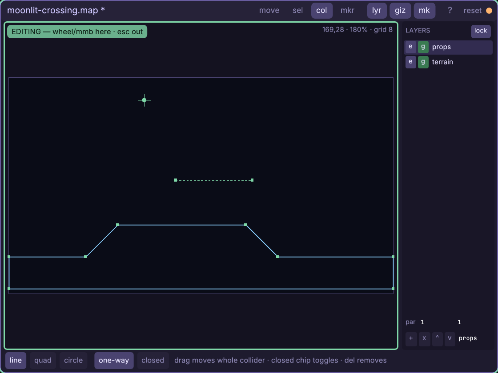
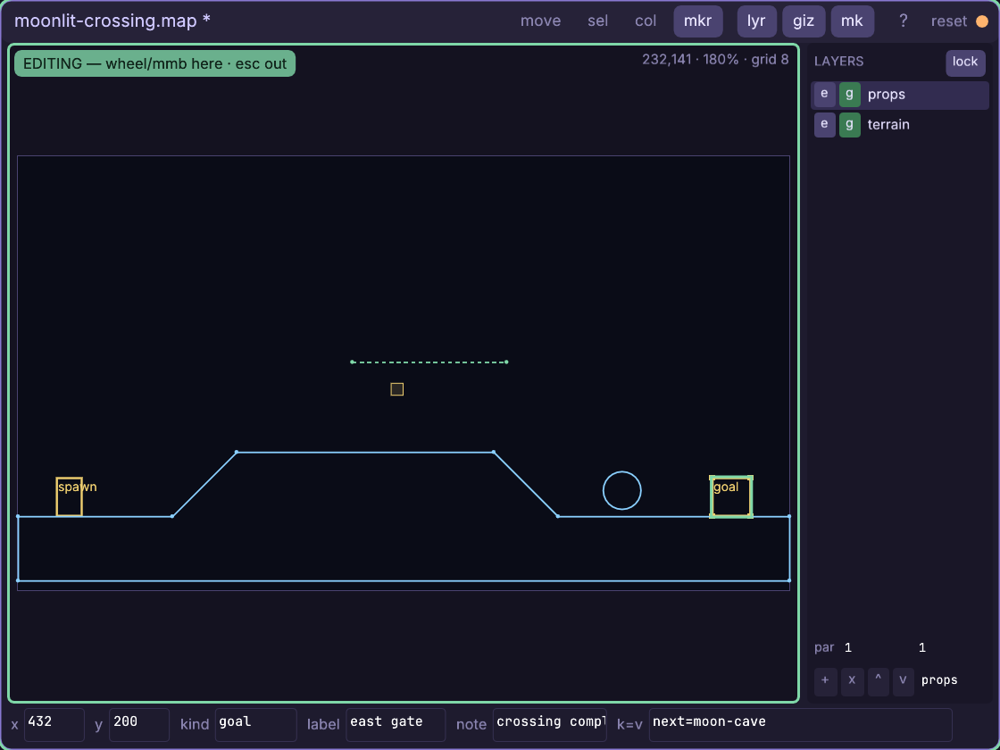
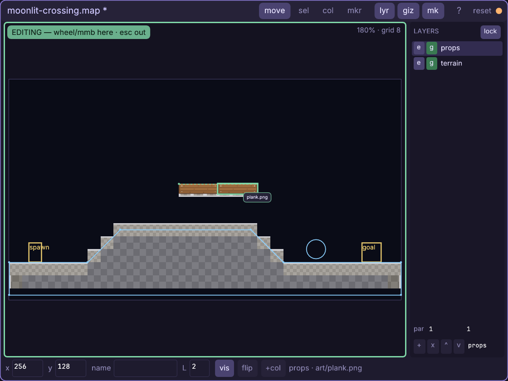
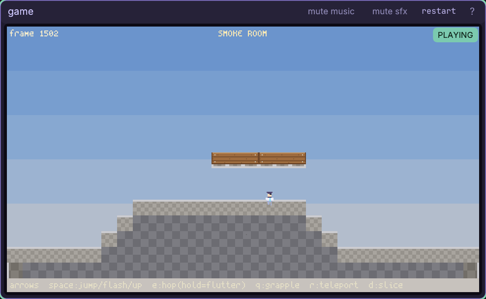

# The map window

Build a playable world from slope-ready collision, free-positioned art,
queryable hazards, and named markers your game can understand.

Every control and gesture: [the map reference](engine/stock/docs/ref-map.md) —
all four modes, CTRL snapping, layers, inspectors, grouping, files, and code.

## Walkthrough: build Moonlit Crossing

In one sitting you will author `maps/moonlit-crossing.map`: a closed ground
polygon with two 45-degree banks, a one-way plank bridge, a circular hazard,
`spawn` and `goal` markers, a generated graybox skin, and two aligned art
placements. Then you will load it into the running game and walk the slopes.

The exact playtest commands below use the bundled **smoke** project because it
already supplies a collision-driven hero and `art/plank.png`. Start that
project in the editor, or follow the authoring steps in your own platformer and
substitute an image of similar size. Coordinates are map pixels. While the
pointer is over the view, its top-right readout shows `x,y` before zoom and
grid, so every point below can be placed deliberately.

1. Right-click empty canvas, choose **map**, replace the suggested path with
   `maps/moonlit-crossing.map`, and press Enter. A fresh map adopts the
   project's 480x270 design size and an 8px grid. In the bottom strip set
   **bg** to `0.25 0.32 0.48` and **name** to `moonlit crossing`, pressing
   Enter after each. The window is already a real working document, but no
   file exists until the first save.
2. Give the visual stack jobs before it fills up. In **LAYERS**, edit the
   first row's footer name to `terrain`. Click **+**, name the new front row
   `props`, and leave it active. Turn **lock** on: later art drops now stay on
   `props`, even when their pixels overlap the generated terrain. The `e` and
   `g` squares mean editor-visible and game-on; leave both lit.
3. Click inside the map to focus it. The green **EDITING** chip means wheel and
   middle-drag belong to this view; **shift+1** refits it and Esc releases it.
   Press **c** for **col**, leave **line** solid, and hold Ctrl while dragging
   from `(0,224)` to `(96,224)`. That makes the first two points in one
   gesture. Ctrl is the precise form: the endpoints land on the 8px grid and
   the segment locks horizontal.
4. Keep both Shift and Ctrl held and click, in order, at `(136,184)`,
   `(296,184)`, `(336,224)`, `(480,224)`, `(480,264)`, and `(0,264)`.
   Shift extends the last line; Ctrl makes the two banks true 45-degree
   slopes. The selected chain now outlines the walkable surface and the mass
   below it. Click **closed** in the bottom strip. Closed plus solid makes the
   interior terrain; an open solid chain would collide only along its edges.
5. Press Esc to return to **move**, then **c** for a clean collider placement.
   Click **one-way**, keep **line**, and Ctrl-drag from `(208,128)` to
   `(304,128)`. Its dashed green gizmo is support from above only: the player
   can jump through it and drop through it, while the solid ground remains
   blue and blocks from either side.

6. Press Esc, then **c** again, and choose **circle**. Ctrl-drag from
   `(376,208)` toward `(388,208)`. With the circle selected, make its exact
   bottom fields read **x 376**, **y 208**, **r 12**. Circles do not block the
   platformer mover; they are query zones. This one is Moonlit Crossing's
   water-orb hazard, tested with `world:circles(...)` in the playtest.
7. Press **m** for **mkr**. Ctrl-drag `(24,200)` to `(40,224)`, then set
   **kind** to `spawn`, **label** to `west bank`, and **note** to
   `moonrunner arrives here`. Set **k=v** to `facing=right`. Press **m** again and
   Ctrl-drag `(432,200)` to `(456,224)`; set kind `goal`, label `east gate`,
   note `crossing complete`, and `k=v` to `next=moon-cave`. Markers are named
   rectangles for code, not collision. Their labels and notes are authoring
   context; extras are compact gameplay fields.

8. Press Esc twice: once returns to **move**, once clears the selected goal.
   The map fields return along the bottom. Click **graybox**. The editor
   rasterizes the free ground and one-way into
   `maps/moonlit-crossing_gb.tm`, places it at `(0,0)` on the bottom
   `terrain` layer as `graybox`, and turns **fill** off. This is a replaceable
   blockout skin; the collider gizmos remain the authority and stay visible.
9. Open **assets**, choose **image**, and filter `plank`. Drag
   `art/plank.png` onto the map with the pointer at `(232,134)`; its 48x12
   ghost lands freehand at `(208,128)`, directly under the one-way line. Drag
   it in a second time while holding Ctrl. As its left edge approaches the
   first plank's right edge, the vertex guide catches and the ghost lands at
   `(256,128)`. Release there. Art and collision now agree without making art
   obey a grid all the time.

10. Press Esc for **move** and click low inside either plank, away from the
   collider line. Its inspector reads the exact **x/y**, layer `2`, and
   source path. Now click directly on the line: the precise collider edge is
   first in the drill stack; click that same spot again to reach the plank
   beneath. Drag the edge to move the whole line, or a square handle to move
   one point. Undo that experiment with **ctrl+z** so the bridge returns to
   `(208,128)-(304,128)`. This click-again drill is how crowded maps stay
   directly editable.
11. Press **ctrl+s**. The amber dot and title `*` disappear, the `.map` is
   atomically published, and the running game is offered a recorded hot
   reload. The graybox `.tm` was already published by its button; it remains
   an ordinary project asset you can open in the tilemap window later.
12. For the bundled smoke playtest, press the grave/backtick key to summon a
   **console** window. Enter these two lines separately. The first switches
   the cartridge's stable room slot and warps its hero to your marker. The
   second temporarily makes every circle a reset hazard:

        game.level.reset("maps/moonlit-crossing"); cm.require("player").warp(game.level.spawn.x, game.level.spawn.y)
        old_step=game.step; game.step=function() old_step(); local p=cm.require("player"); local x,y=p.pos(); if #game.level.world:circles(x,y,p.W,p.H)>0 then p.warp(game.level.spawn.x,game.level.spawn.y) end end

13. Spawn or focus the **game window**, click inside until **PLAYING** shows,
   and hold Right. The hero walks from the flat west bank, stays grounded up
   the first 45-degree slope, crosses the plateau, and sticks to the descent.
   Jump through the plank bridge and land on it; Down+Jump drops through.
   Walk into the circle and the temporary hazard adapter returns you to the
   spawn. Jump over it to reach the gold `goal` rectangle's authored area.

The important loop is now live: return to Map, move a bank or marker, save,
and feel the revised route in the same game window. Unsaved edits stay safely
in the authoring window; Ctrl+S is the explicit game-truth boundary.

## Put the same map in your game

Load once into a stable slot, derive the named marker handles whenever the map
revision changes, sweep the player against `room.world`, and draw both the
optional collider fill and placed art:

    local map = cm.require("cm.map")
    local box = cm.require("cm.box")
    local room, spawn, goal, seen_rev

    local function sync_markers()
      map.sync(room)
      if room.rev == seen_rev then return end
      seen_rev, spawn, goal = room.rev, nil, nil
      for _, m in ipairs(room.doc.markers) do
        if m.kind == "spawn" then spawn = m end
        if m.kind == "goal" then goal = m end
      end
    end

    function game.init()
      room = map.use {
        path = cm.main.args.project .. "/maps/moonlit-crossing.map",
        name = "mygame.moonlit-crossing",
      }
      sync_markers()
      player.x, player.y = spawn.x, spawn.y
    end

    -- in game.step, after choosing dx/dy:
    sync_markers()
    player.x, player.y, hit = room.world:move(
      player.x, player.y, PW, PH, dx, dy,
      { ground = player.grounded, drop = drop_pressed })
    player.grounded = hit.down
    if #room.world:circles(player.x, player.y, PW, PH) > 0 then
      player.x, player.y = spawn.x, spawn.y
    elseif goal and box.overlap_rect(player.x, player.y, PW, PH, goal) then
      player.won = true
    end

    -- in game.draw, with the world layer active:
    map.draw_fill(room, camera.x, camera.y)
    map.draw_places(room, camera.x, camera.y)

`map.draw_fill` quietly does nothing after **graybox** turns fill off;
`draw_places` then draws the generated tilemap and both planks. Keeping both
calls makes the same code work before and after the blockout gets art.

Full reference: [every Map control and gesture](engine/stock/docs/ref-map.md),
[maps and collision in code](engine/stock/docs/scripting.md#loading-and-drawing-a-map-cmmap),
and [the tilemap tutorial](engine/stock/docs/win-tmap.md) for replacing the
generated blockout with a reusable authored chunk.
