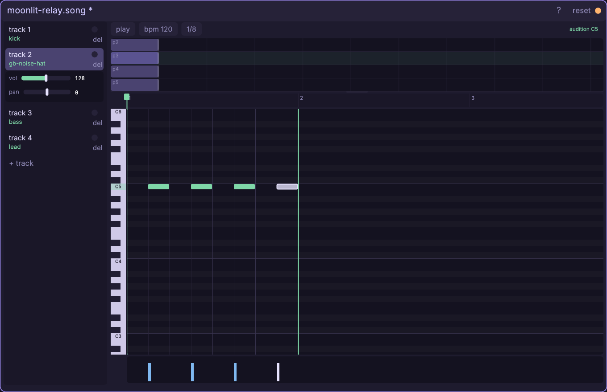
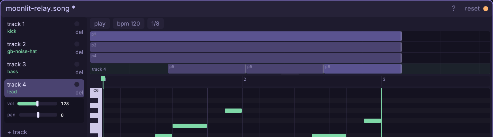
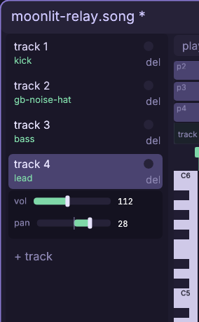

# The music window

Turn a handful of instruments into a looping scene with rhythm, melody,
arrangement, dynamics, and a stereo shape.

Every control and gesture: [the Music reference](engine/stock/docs/ref-music.md) —
tracks, clips, piano-roll editing, velocity, mix, transport, files, and code.

## Walkthrough: arrange Moonlit Relay

This lesson makes `sound/moonlit-relay.song`: an eight-bar night-run cue with
kick, off-beat hat, a two-bar bass turn, and a lead that enters late, repeats
as a linked pattern, then answers with an independent pattern. You will hear
notes while placing them, move and resize a selection, place a cross-pattern
paste ghost, loop clips on the arrangement, and finish with a deliberate
left/right mix.

The exact path continues [the Synth tutorial](engine/stock/docs/win-synth.md)
in the bundled **smoke** project. It expects `ins/kick.ins`, `ins/bass.ins`,
and `ins/lead.ins` from that lesson. In another project, substitute three
pitched/percussive instruments of your own. The hat comes straight from Stock,
so that part works everywhere.

Music time is exact. One beat is 96 ticks; one four-beat bar is 384. With the
**1/8** grid used below, every cell is 48 ticks. Move over empty roll space and
the transport's right bay names the snapped destination, for example
`bar 1 beat 4+48 · C3 · tick 336`. Over a stored note it also reports
duration and velocity. The keyboard uses sharp names, so A-sharp is `A#`.

1. Right-click empty canvas and choose **music**. Replace the suggested path
   with `sound/moonlit-relay.song` and press Enter. The fresh song opens at
   **bpm 120** with one track, one four-bar starter clip, and the **1/8**
   placement grid. It is working state now, but no `.song` exists on disk
   until the first save.
2. Click the starter `p1` clip in the top arrangement and press **Del**. Click
   **track 1** in the left rail: because it has no clip, the row creates a
   fresh one-bar pattern and clip at bar 1, then drills the roll into it. Click
   **+ track** three times. You now have four rows, while only track 1 has
   music yet.
3. Open **Assets**, choose **sound**, and bind the local instruments by
   dragging `kick.ins` to track 1, `bass.ins` to track 3, and `lead.ins` to
   track 4. The destination row outlines before release. Open **Stock**, choose
   **ins**, filter `gb-noise-hat`, and drag that stock row onto track 2. Stock
   is external, so the drop first copies it to
   `ins/gb-noise-hat.ins`; all four song bindings are now project-relative.
4. Click track 2, track 3, and track 4 once each. Every clipless row gets its
   own fresh one-bar pattern and a bar-1 clip. The selected row expands its
   volume/pan panel, its clip glows in the arrangement, and the roll always
   follows that track's instrument. Return to **track 1** for the kick.
5. Keep **1/8**. On the C3 row, click tick `0`, deliberately add another at
   tick `96`, then right-click that mistaken note to remove it. Add C3 at
   ticks `192` and `336`. The result is beats 1 and 3 plus the final eighth
   before the loop. A plain click stores a 48-tick note; holding the press
   keeps auditioning without making it longer.
6. Select track 2. On C5, press and hold tick `48` for a moment, then release:
   the hat rings for as long as your hand is down but remains one grid cell.
   Add C5 at ticks `144`, `240`, and `336`. Press and hold the C5 key in the
   piano column to audition the bound hat without recording another note.

7. Select track 3. Press C3 at tick `0` and drag its end through tick `96`;
   after release the bay reads `dur 96`, and quarter-note length becomes the
   new placement default. Click E-flat 3 at `192`, A-sharp 2 at `384`, and G3
   at `576`. The final two notes are in bar 2, so the pattern end grows from
   one bar to two and never snaps back shorter.
8. Select track 4 and place the first lead motif with the inherited 96-tick
   length: G4 at `0`, A-sharp 4 at `144`, C5 at `192`, and E-flat 5 at
   `336`. Drag the right edges of the A-sharp and E-flat notes back to
   `dur 48`. Hold Shift and marquee across all four notes, then press
   **Ctrl+C**. The four-note motif is now on the session clipboard.
9. Press **Ctrl+V**. A translucent ghost follows the roll; put its first G4 at
   bar 2 tick `384` and click once. The paste disarms and its four new notes
   stay selected. Drag that selected G4 straight down to F4 without changing
   its tick; all four pasted notes move down two semitones together. In the
   velocity lane, drag the selected bar at tick 384 from `100` to `82`. The
   whole answer softens together while the original motif stays at 100.
10. Work in the arrangement strip. Drag the right edges of the kick, hat, and
   bass clips to the end of bar 8, tick `3072`. A long clip loops its pattern:
   the one-bar drums repeat eight times, while the two-bar bass turn repeats
   four times. If the edge is cramped, wheel over the arrangement to zoom its
   own time view; the roll zoom below does not change.
11. Resize the lead's `p5` clip to two bars, then drag it to bar 3
   (tick `768`). Hold Ctrl and drag that clip to bar 5 (tick `1536`).
   The copy is linked: both clips say `p5` and glow together because editing
   either placement edits their one shared pattern.
12. Click empty track-4 arrangement space at bar 7 (tick `2304`). A fresh
   `p6` clip and independent pattern appear. Press Ctrl+V and place the saved
   motif at pattern tick `0` with its first note on C5. Arm Ctrl+V again and
   place it at tick `384` with its first note on A-sharp 4. Resize `p6` to two
   bars. The final lead lane reads `p5 · p5 · p6`: statement, linked repeat,
   then a separately editable answer.

13. Give the mix a shape by selecting each rail row in turn. Type the exact
   **vol** value, then drag **pan** until its numeric field matches:
   kick `150 / 0`, hat `92 / -36`, bass `132 / 0`, and lead
   `112 / +28`. Kick and bass hold the center; the hat leans left and the
   lead answers on the right. Both controls update a running preview live.

14. Click the scrub ruler at bar 3, tick `768`, and press **Space**. Preview
   begins where the lead enters, crosses both linked `p5` clips into `p6`,
   then wraps around the eight-bar song. Watch the arrangement playhead and
   listen for the softer second half of pattern A. Press Space again to stop.
15. Press **Ctrl+S**. The amber dot and title `*` clear, the CSNG source
   publishes atomically, and Assets discovers it. Reopen the file later and
   the six clips still contain two deliberate references to `p5`; a linked
   pattern is a saved relationship, not an editor-only trick.

The useful mental split is now concrete: **patterns contain notes**;
**clips place and loop patterns**; **tracks choose instruments and mix**.
Drill down by clicking a clip, write a small musical idea once, then decide in
the arrangement whether the next section should link, repeat, or answer.

## Play the saved loop in a game

Start it once from game code. The default is to loop; passing
`{ loop = false }` makes it stop at the arrangement end:

    local snd = cm.require("cm.snd")

    function game.init()
      snd.music(cm.main.args.project .. "/sound/moonlit-relay.song")
    end

    function game.win()
      snd.music_stop()
    end

Song playback is simulation state: it records, replays, and rewinds with the
game. Editor audition uses a separate render-only bank, so composing never
changes a running simulation.

Full reference: [every Music control and file rule](engine/stock/docs/ref-music.md),
[the instrument-building tutorial](engine/stock/docs/win-synth.md),
[the Synth reference](engine/stock/docs/ref-synth.md), and
[songs in game code](engine/stock/docs/scripting.md#sound-effects-and-music-cmsnd-cmins).
