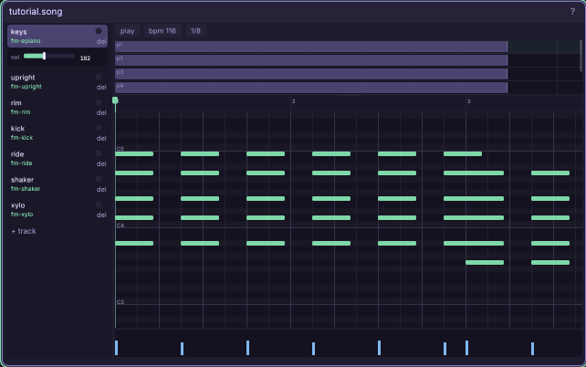

# The music tracker

Compose a song (`.song`): tracks of patterns arranged into clips, over
instruments you designed in the synth.

## Workflow

1. Drag an instrument (`.ins`) onto a track row to bind it — the row
   the drop will bind outlines while you drag, so aim by the highlight.
2. In the piano roll, place notes; arrange patterns as **clips** on the timeline
   (a clip loops its pattern when you stretch it).
3. Select a track to open its mix panel. Set per-track volume — **128**
   preserves the preset's authored level, **0** is silence, and **255** can
   bring even a quiet preset all the way forward. Set **pan** from **-64**
   (hard left) through **0** (center) to **+64** (hard right); the slider snaps
   into center. Both controls update a playing preview live. **ctrl+s** saves.
   The game plays the same mix with `cm.snd.music(...)`.

## The arrangement (top strip)

The strip shows the whole song — patterns placed as **clips** on per-track lanes.
It has its **own view**, like the roll: **wheel** zooms its time axis,
**middle-drag** pans (both axes), and you can **drag its bottom edge to resize**
the panel taller/shorter. Lanes keep a fixed readable height and
**scroll vertically** when a song has many tracks. Click a clip to drill into its pattern
below; drag to move it, its right edge to stretch it, **ctrl+drag** to place a
linked copy.

## The roll grammar

- **press empty** adds a note (at the last-used length, grid-snapped) —
  **keep holding and drag right to sustain it**: the note's end follows
  the cursor, and that length becomes the new last-used default
- **click** a note selects it — selected notes grab first and draw on
  top, slightly see-through, so an overlap stays visible and fixable
- **drag** moves the selection in grid steps (an off-grid note keeps
  its offset) · **drag its right edge** resizes
- **right-click** deletes a note · **shift** toggles / marquee-selects
- **ctrl+drag** a note duplicates it
- the **piano keys** on the roll's left edge audition pitches on the
  active track's instrument — click a key, or drag along the keyboard;
  the key under your cursor highlights while you place notes

## Keys

- **space** play / stop (from the scrub cursor) · **del** delete the selection
- **1–6** set the placement grid · **esc** cancels a paste / clears the
  selection / stops
- **ctrl+up / ctrl+down** move the selection an octave
- **ctrl+c/x** copy / cut · **ctrl+v** arms a paste **ghost** riding the
  mouse — click places it, esc or right-click cancels; the clipboard
  crosses song windows, so copy here and paste into another `.song`
- **ctrl+z / ctrl+y** undo / redo · **ctrl+s** save
- **wheel** zoom · **middle-drag** pan (while focused)

## Walkthrough: a 4-track loop, arranged

An eight-bar loop that exercises the tracker's real strengths —
patterns that loop as stretched clips, linked copies, and an
arrangement you can rework without retyping notes.

1. **Bind sounds**: drag `gb-noise-kick` to track 1, `gb-noise-hat` to
   track 2, your `ins/bass.ins` to track 3, a pulse lead
   (`gb-pulse-12`) to track 4.
2. **Drums, one bar**: grid **4** — kicks on the beats, then hats on
   the off-beats one track down. Right-click deletes a misplaced note.
3. **Bass, two bars**: root notes on the beat, then drag a few right
   edges longer so they slur. Keep it to 4–5 notes; space is groove.
4. **Loop them**: in the arrangement strip, stretch the drum clip to 8
   bars (a clip loops its pattern), stretch the bass to 8.
5. **Lead, four bars**: write it once, then **ctrl+drag** the clip to
   place a *linked* copy for bars 5–8 — edit either and both change.
   When the second phrase should answer instead of repeat, drag a plain
   copy and bend just its tail notes.
6. **Arrange**: **space** from the top. Pull the lead clip off bars 1–4
   entirely — starting with drums+bass and letting the lead enter at
   bar 5 is the oldest arrangement trick and it works in eight bars.
7. **ctrl+s**, then `snd.music(..., { loop = true })` in `game.init`
   (the scripting guide's sound section has the exact call). Leave it
   playing while you keep editing — saves hot-swap the song.

Full reference: [The synth](engine/stock/docs/win-synth.md) and
[songs in game code](engine/stock/docs/scripting.md#songs-as-data-cmsong).
