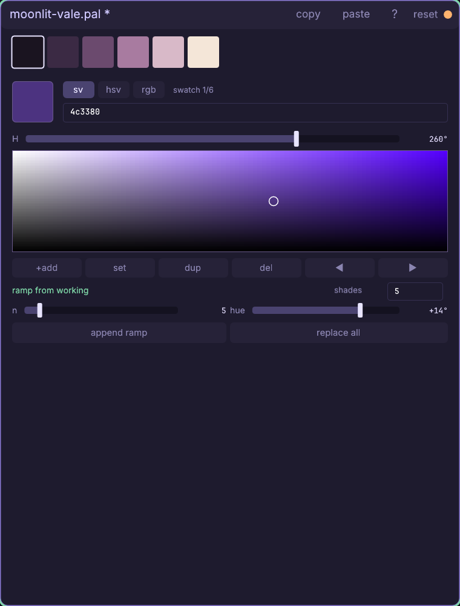
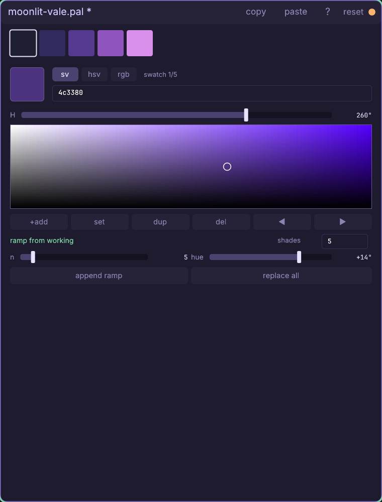
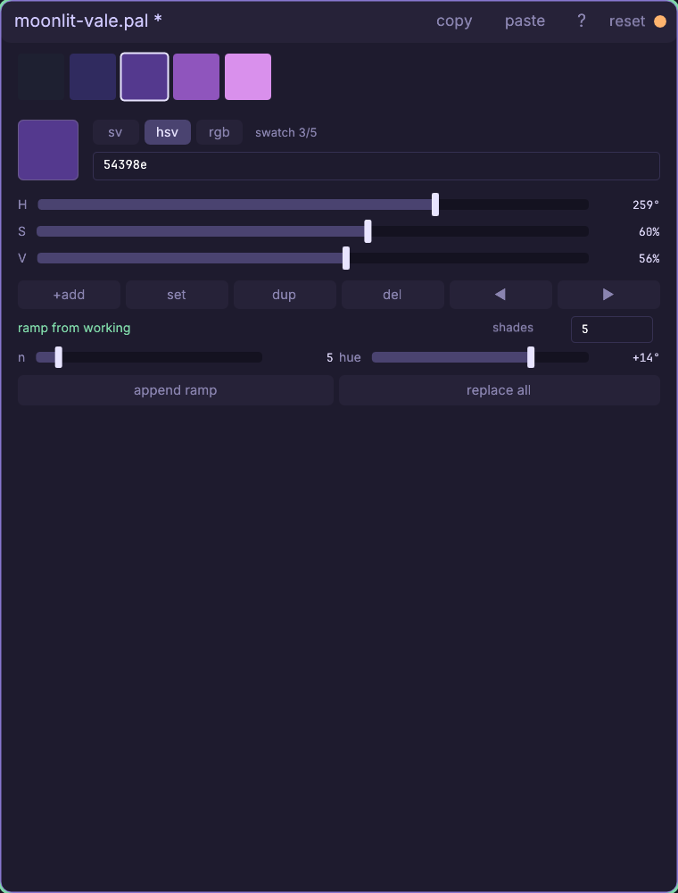
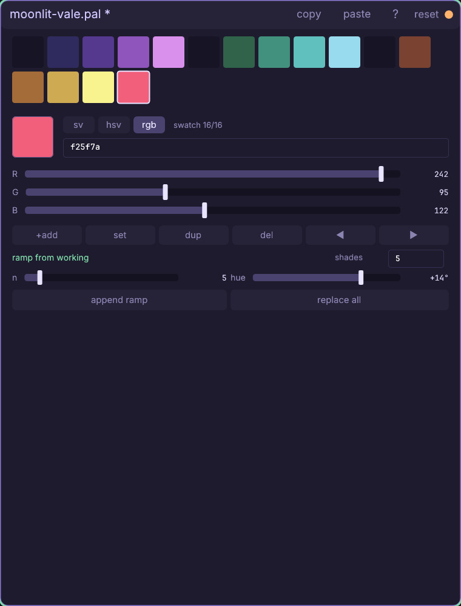
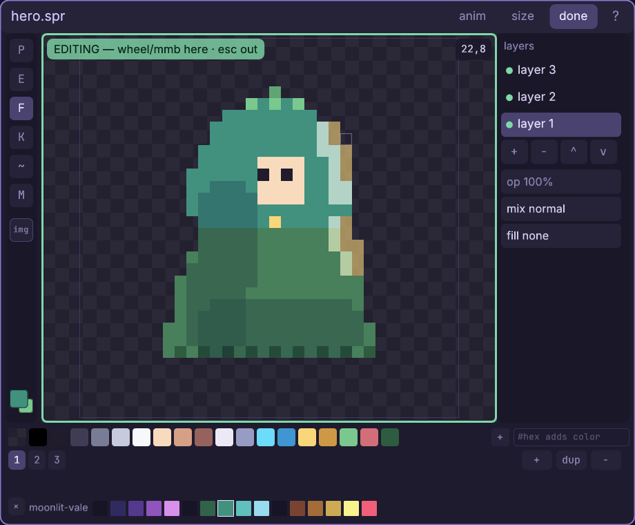

# The palette window

Color-script a whole game from a few intentional fundamentals: mix colors,
grow hue-shifted ramps, keep one shared shadow, and paint from the result.

Every knob and button: [the palette reference](engine/stock/docs/ref-palette.md) —
the pickers, swatch operations, ramp math, clipboard, hotkeys, and `.pal` format.

## Walkthrough: color-script a moonlit vale

In one sitting you will make `pal/moonlit-vale.pal`: three five-shade
families — night violet, moss teal, lantern gold — tied together by one
shared shadow, then punctured by one rose accent. Those are
**16 colors with jobs**, not 16 unrelated favorites. At the end you will stack
the palette in the sprite editor and recolor the tutorial hero from it.

You can use any sprite for the last two steps. The exact payoff below uses
`art/hero.spr` from [the sprite tutorial](engine/stock/docs/win-sprite.md);
frame 1 and the bottom body layer give us a clean place to test the palette.

1. Right-click empty canvas, choose **palette**, replace the suggested path
   with `pal/moonlit-vale.pal`, and press enter. Six starter swatches appear,
   but they are only scaffolding: the large framed square below them is the
   separate **working color**, initially white. Mixing changes that scratch
   square, never a saved swatch.
2. Leave the **sv** mode chip on. Drag **H** until its readout says **260°**,
   then click the SV square **60% across and halfway down**. Saturation runs
   left to right; value runs white to black from top to bottom. The crosshair
   lands on a restrained night violet and the hex field reads `4c3380`.

3. In **ramp from working**, leave **shades 5**, **n 5**, and **hue +14°**.
   Five is enough to name outline, shadow, body, light and glint without
   making color choice mushy. Click **replace all**: the starter disappears
   and one dark-to-light violet ramp takes its place. The working square is
   still the original base — generating did not silently select or alter a
   saved shade.

4. Double-click the **third swatch**. Its outline selects it and its exact
   bytes move into the working square; the other five saved colors do not
   move. Click **hsv**. The three numeric rows now explain that adopted color
   as hue, saturation and value. This select-then-adopt split is deliberate:
   a single click is safe navigation, while double-click or **enter** says
   "make this my next mix."

5. Make the moss family with the exact HSV rows: **H 165°**, **S 55%**,
   **V 55%**. The hex field settles on `3f8c79`. Keep five shades and +14°,
   then click **append ramp**. The counter still names your selected violet,
   while five teal shades appear at the end — ten saved colors total.
6. Click **rgb** for the lantern family. Set **R 209**, **G 138**, **B 72**;
   the shared hex view reads `d18a48`. Click **append ramp** again. RGB is the
   useful door when a paint-over, brand guide, or reference gives you channel
   values rather than a color-wheel idea. You now have fifteen colors.
7. Add the exception that makes the system sparkle. Type `f25f7a` in the hex
   field, click saved swatch **15** (the counter confirms `15/15`), then click
   **+add**. The rose working color is inserted after the selection and becomes
   swatch 16. Reserve it for pickups, damage, flowers, or one decisive UI mark;
   it pops because none of the ramps reaches its saturation.
8. Glue the three materials together. Type `171525` in the hex field. Click
   swatch **1**, then **set**; repeat for swatches **6** and **11**. Those are
   the darkest slots of violet, teal and gold. Giving every material the same
   near-black lets their shadows touch without looking cut from three games.
   Click swatch **16** and press **enter** to leave the rose accent adopted.

The finished order is useful enough to treat as a tiny color script:

    1       shared shadow   171525
    2-5     night violet    302b5f .. d990ec
    6       shared shadow   171525
    7-10    moss teal       31634b .. 99dbee
    11      shared shadow   171525
    12-15   lantern gold    7a4331 .. f8f38e
    16      rose accent     f25f7a

9. Press **ctrl+s**. The amber dirty dot and title `*` disappear, and
   `pal/moonlit-vale.pal` becomes a project asset. Each add, set and whole-ramp
   operation was one undo step; mixing the working color was not, because the
   scratch is not palette data.
10. Open **assets**, filter for `moonlit`, then press-drag the
   `moonlit-vale.pal` tile onto the hero's sprite window. Release over the
   window content. This does not replace the sprite — a `.pal` stacks as a
   named swatch row beneath its brush strip. Save the palette before dragging;
   the receiving row reads the file on disk and refreshes after later saves.
11. Put the hero in **edit** mode, select frame **1**, and click the bottom
   layer row (layer 1, the body). In the new **moonlit-vale** row, left-click
   its **eighth swatch** (`41917e`) to make that teal your primary. Press **f**
   and flood the cloak at pixel **(18,15)**. The hood turns moonlit teal while
   the existing *mul* shadow and *add* rim light keep its volume — the palette
   changed the material without repainting the lighting.
12. Press **ctrl+s** in the sprite window. The palette remains a reusable
   `.pal`; the chosen color is now in the hero's baked pixels. Try another
   swatch with **ctrl+z** ready, or keep this as the first color-scripted frame.

## In the game

Load a palette once, then use its ordered roles instead of scattering color
literals through the draw code:

    local palette = cm.require("cm.palette")
    local paint = cm.require("cm.paint")
    local path = cm.main.args.project .. "/pal/moonlit-vale.pal"
    local vale = assert(palette.load(path))

    function game.draw()
      local r, g, b = paint.unpack(vale.colors[1]) -- shared shadow
      pal.quad(0, 0, 480, 270, r / 255, g / 255, b / 255, 1)
      -- draw the world; use vale.colors[16] for the rare accent
    end

`palette.color(path, index, fallback)` is the short safe lookup when you do
not need the whole document. Editor saves bump the asset epoch, so the next
load sees your revised colors live.

Full reference: [every control in this window](engine/stock/docs/ref-palette.md),
[the sprite editor](engine/stock/docs/ref-sprite.md), and
[palettes in game code](engine/stock/docs/scripting.md#palettes-and-color-grading-cmpalette-cmgrade).
