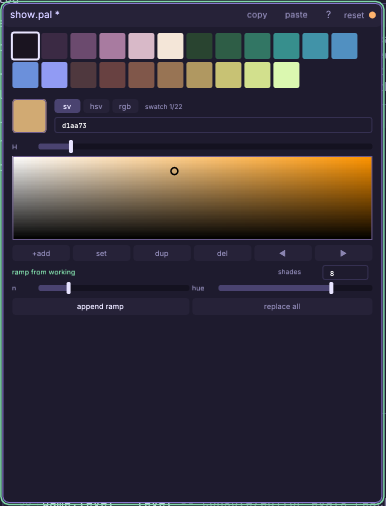

# The palette editor

Design a palette (`.pal`): a list of colors your game and sprites draw from.
Mix in the **working color**, save swatches, and generate hue-shifted value
**ramps** (warm highlights, cool shadows). Copy/paste whole palettes as
Lospec hex.

## The working color

The framed swatch under the grid is the **working color** — a scratch mix,
deliberately separate from the saved swatches: tuning it never edits the
palette, and appending ramps back to back never disturbs the previous
ramp's colors. Colors move between the mix and the grid only on purpose:

- **double-click** a saved swatch (or select it and press **enter**) to
  load it into the working color;
- **+add** inserts the working color after the selection; **set**
  overwrites the selected swatch with it.

Pick with whichever method fits your head: the **sv** square (drag inside;
the H slider above sets the hue — the fastest "hit the color I'm
imagining" surface), **hsv** sliders (precise saturation/value moves),
**rgb** sliders (matching a known channel value), or type a hex code.
The chips above the hex field switch modes.

## Ramps

A ramp is N shades of one color, dark to light, with the pixel-art
principles baked in: a value spread, a per-step hue shift (toward warm as
it lightens, toward cool in shadow), and a saturation bell (slightly
grayer at both ends). Set **shades** (2–32, typed or dragged) and **hue**
(degrees per step; negative flips the direction), then:

- **append ramp** — adds N shades of the *working color* to the palette;
- **replace all** — restarts the whole palette as that one ramp.

## Walkthrough: making a cohesive palette

The workhorse recipe — **N shades of each fundamental, flavored to the vibe**:

1. Fix the shade count first and keep it for every ramp (5 reads chunky
   and confident; 7–9 reads soft). Same count = interchangeable shading
   across materials.
2. Mix the first base color by eye in the **sv** square — aim for the
   *mid-tone* of the material (grass, skin, stone), not its brightest.
3. **append ramp**. Double-check the two ends: the darkest shade should
   still read as the color, the lightest shouldn't blow out to white.
4. Load the base back (double-click a mid swatch), nudge the hue toward
   the next fundamental, and repeat until the fundamentals you need are
   covered (a common working set: warm gray/brown, skin, red, orange,
   yellow-green, green, teal, blue, purple).
5. Flavor to the vibe with the **hue** shift and the bases themselves:
   for a hot desert push every base slightly toward orange and use a
   strong positive hue shift (+18 or more) so highlights go golden; for a
   cold night push the bases toward blue and keep shadows violet; for a
   pastel look raise every base's value and lower its saturation before
   ramping.

Two glue tricks make separate ramps read as ONE palette:

- **Shared shadow**: make the darkest one or two shades of every ramp
  converge on the same color family (a deep violet or warm near-black) —
  set them by hand with **set** after generating. One shadow color unifies
  everything drawn with the palette.
- **Shared accent**: keep one or two saturated outlier swatches (UI,
  pickups, blood) that appear in no ramp; they pop precisely because
  nothing else reaches that saturation.

**Wide vs. narrow (film / near-monochrome) palettes.** The recipe above
is the wide case — most hues represented, games that show many materials.
For a stronger, more "graded" look, invert the ratios: pick ONE dominant
hue and give it a long ramp (9–16 shades via the typed count), add at
most one or two short support ramps (3–4 shades) in a contrasting hue,
and stop. A horror scene might be a 12-shade desaturated teal ramp plus a
3-shade blood red; a sepia film look is one long warm-brown ramp with a
cold gray counter-ramp. With the working color separate, this is quick to
try: mix the dominant, type a big shade count, **replace all**, then mix
the accent and **append ramp** with a small count.

Import references freely: **paste** (header chip) reads any Lospec-style
hex list from the clipboard; **copy** exports yours the same way.

## Keys

- **left / right** select the previous / next swatch
- **enter** load the selected swatch into the working color
- **a** add the working color · **d** duplicate the selected · **del** delete it
- **ctrl+z / ctrl+y** undo / redo · **ctrl+s** save

Swatches are eyedropper-pickable from the canvas: arm the sprite editor's pick
tool and click a swatch to sample it. Game code reads the file with
`cm.palette.load(...)`.

Full reference: [The sprite editor](engine/stock/docs/win-sprite.md) and
[palettes in game code](engine/stock/docs/scripting.md#palettes-and-color-grading-cmpalette-cmgrade).
