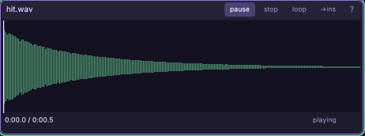

# The sound player

Drop any `.wav` / `.mp3` / `.ogg` to inspect and audition it. The header **→ins**
button mono-mixes it into a sampler instrument and opens it in the synth.

Every knob and button: [the sound player reference](engine/stock/docs/ref-sound.md).

## Keys

- **space** play / pause · **home** jump to the start · **l** loop toggle
- **click the waveform** to seek

## Walkthrough: turn a recording into an instrument

1. Drop a short WAV hit or field recording into the editor. Click the waveform
   to find the useful transient, use **home**, **space**, and **l** to judge its
   start and tail at normal listening volume.
2. Press **→ins**. The engine mono-mixes the complete source into an embedded
   sampler instrument and opens it in the synth — the project no longer
   depends on the external source path.
3. In the synth, set the root note, shorten release for a tight one-shot (or
   enable a loop for a texture), and audition across the tracker-key rows.
   Save as `ins/field-hit.ins`.
4. Drag that instrument onto a music track for pitched sequencing, or upload it
   once and trigger it from `game.step`. Compare it against the mix with the
   sound player's volume at a comfortable level, not only at maximum output.

Full reference: [every knob and button](engine/stock/docs/ref-sound.md),
[the synth](engine/stock/docs/win-synth.md),
[the music tracker](engine/stock/docs/win-music.md), and
[sound in game code](engine/stock/docs/scripting.md#sound-effects-and-music-cmsnd-cmins).
