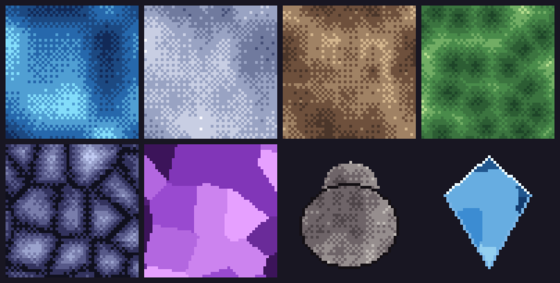

# The sprite editor

Paint a pixel sprite; define animation clips in the paired **animation** window.

## Workflow

0. A fresh (unbound) sprite window is the **new sprite** door: type a path —
   a unique name is prefilled — and Enter creates a 32x32 sprite there (an
   existing path offers open / overwrite / cancel). Or drag any `.spr` in
   from an assets window.
1. Toggle **edit** (header) to paint; the view lock lights up so wheel/pan act
   on the sprite, not the canvas.
2. Pick a tool, pick a color (or eyedrop one from anywhere on screen), paint.
3. **ctrl+s** saves and bakes the `.png` the game draws.
4. Open **anim** (header button) to cut the strip into clips (frame:duration).
5. **size** (header, edit mode) resizes the canvas: type `WxH` and Enter.
   The default **canvas** mode keeps pixels where they are (grow adds
   transparent room, shrink crops); the **scale** mode resamples the art to
   fill the new size. One undo step; mesh texture sheets usually want 64x64
   or more.

## Tools (edit mode)

- **p** pen · **e** eraser · **f** fill · **k** pick (eyedropper) · **~ c** curve
- **t** stamp (once an image is in the stamp well, below)

The pick tool is a **global eyedropper** — click anywhere (other windows, the
live game) to sample that color.

The **curve** tool is the classic 2-point curve: click the start, click the
end, then move the mouse to bow the line and click to lay it (esc cancels).

## Brush size, shape and opacity

The strip under the canvas dials the pen/eraser brush: **size** (1-32 px,
default 1 — also `[` and `]`), **opacity** (drag; applied once per stroke,
so a slow drag never darkens twice), and the **shape** chip toggles
**circle / square**. The eraser honors all three — a low-opacity eraser
fades pixels instead of deleting them.

## The stamp well

The square slot at the bottom of the tool rail is the **stamp well**:
**drag any sprite or image onto it** and it becomes a stamp — click the
canvas to print its opaque pixels (a ghost preview shows where it lands;
one click = one undo step). Click the well or press **t** to re-arm the
stamp tool; right-click the well (or the strip's `x` chip) to clear it.

## Two colors + lines

- **left-click paints the primary color, right-click the secondary** — the two
  swatches sit at the bottom of the tool rail; **x** swaps them, and a
  right-click on either the rail swatch or a palette swatch sets the secondary.
- **hold shift** and click with the pen/eraser to draw a
  **straight line from the last pixel you painted** (a preview line
  shows first).

## Layers: opacity, blend modes, lock and order

The right rail lists the layers top-down. Click a row to select it, click
the **eye dot** to hide/show, **right-click a row to lock it** (a locked
layer refuses paint; a small red dot marks it). Under the list, **+ -**
add/delete and **^ v** move the selected layer up/down the stack.

Below that sit the selected layer's **mix controls**:

- **op** — layer opacity (drag the dial; 5% steps).
- **mix** — the blend mode: **normal, mul, add, screen, overlay**
  (click cycles forward, right-click back). *mul* darkens (shadows,
  texture), *add* glows, *screen* lightens softly, *overlay* adds
  contrast. Over empty pixels every mode just paints, so a blend layer
  never blackens transparent canvas.

## Fills: gradients and procedural fields

The **fill** chip gives the selected layer a live, non-destructive fill —
saved in the `.spr`, re-rendered every time the sprite composites, and
adjustable forever until you **bake** it. Click to cycle (right-click goes
back): four gradients (**linear, radial, angular, mirror**) and six
**procedural fields** — **noise** (soft value noise), **fbm** (cloudy
fractal), **ridged** (creased strata — rock veins), **cells** (organic
cells/scales), **shards** (cracks between cells — cobblestone), and
**facets** (flat random tone per cell — crystal planes).

By default a fill **recolors the layer's painted pixels** (the shape is
yours, the colors are the ramp's — draw a rock silhouette, pick *ridged*,
and it shades itself). Toggle **solid** to cover the whole canvas instead:
an empty layer + a solid *fbm* + *mix mul* + a low **op** is "a layer of
noise, blended to taste".

The dials underneath tune it live:

- **sd** — the random seed (drag to reroll the field).
- **px** — feature size in pixels (procedural types).
- **oct** — detail octaves (fbm/ridged).
- **lv** — color bands; **di** — dither strength between bands. Every
  output pixel is an exact ramp color — dithered bands, never a blur.
- **cols** re-ramps the fill from your secondary → primary color;
  **bake** stamps the fill into the layer's pixels and removes it.

The ramp is created from your two active colors when the fill is born, so
pick the colors first (a transparent secondary makes speckle overlays).

## Walkthrough: fill recipes

Every recipe is: pick secondary (dark) + primary (light), set the fill,
tune dials. All results stay live — reroll **sd** until it looks right.

- **Water tile** — deep blue secondary, pale cyan primary; *noise*,
  **solid**, px ~8, lv 4, a little **di**. The dither bands read as
  ripples; a second layer of *noise* at **mix mul** + low **op**
  roughens the surface.
- **Sand / dunes** — dark red-brown secondary, cream primary; *fbm*,
  **solid**, px 10–14, oct 3. The cloudy octaves make dune shadows.
- **Moss / foliage** — near-black green secondary, yellow-green primary;
  *cells*, **solid**, px 6–10. Reads as leaf clumps; larger px = bushes,
  smaller = lichen.
- **Cobblestone** — near-black blue secondary, light blue-gray primary;
  *shards*, **solid**, px 10–16. The F2−F1 cracks are the mortar lines;
  raise **lv** for flatter stones.
- **Crystal wall** — deep violet secondary, pale lavender primary;
  *facets*, **solid**, px 10–16, di 0. Flat tone per cell = mineral
  planes.
- **A shaded boulder** — draw the silhouette with the pen first (any
  color), keep the fill **masked** (solid off), pick dark slate → warm
  gray, *ridged*, px 8, oct 2–3, lv 4. The strata shade your shape;
  the silhouette stays yours.
- **A cut gem** — draw a diamond silhouette; *facets* masked, deep blue →
  ice blue, px large (few big cells). **bake**, then hand-touch: a
  1px darker outline and a 2px white sparkle at the top facet.
- **Speckle / stars overlay** — transparent secondary, white primary;
  *noise* on an empty **solid** layer, high lv, then **mix screen** over
  the scene below.

## Layer mixes to taste

Blend-mode staples on top of any base: a *mul* + *fbm* layer at ~40%
**op** is instant grime/shadow; an *add* + *noise* layer at low op is
sparkle/heat; *overlay* + *ridged* deepens rock contrast without
touching the palette. Because generated pixels are exact ramp colors,
baking any of these keeps the sprite palette-clean.

## Colors & palettes

New assets auto-name with three random words, so nothing blocks on a filename —
press **enter** to create. The bottom-right **`#hex adds color`** field appends
a typed `#RRGGBB[AA]` to the palette (the swatch left of it previews the parse).

The palette row starts with the **transparent swatch** (the little
checker): select it to paint or **fill with transparency** — the bucket
with transparency erases a whole region in one click.

**Drag a `.pal` in** to stack it as an extra swatch source at the bottom — add
as many as you like; each row has a **×** to remove it. Left/right-click its
swatches to set the primary/secondary color.

Full reference: [Using the editor](engine/stock/docs/editor.md),
[the animation window](engine/stock/docs/win-anim.md), and
[sprites in game code](engine/stock/docs/scripting.md#animation-clips-and-sprites-cmanim-cmsprite).
