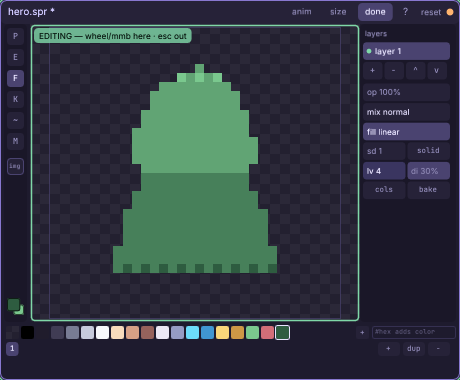
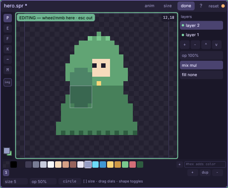
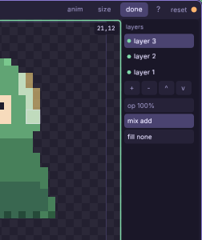
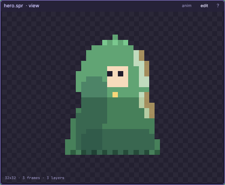

# The sprite editor

Paint a pixel sprite (`.spr`): layers with blend modes, live procedural
fills, a frame strip the animation window cuts into clips.

Every knob and button: [the sprite reference](engine/stock/docs/ref-sprite.md) —
every tool, dial and fill type, plus a recipe card for the ten fills.

## Walkthrough: paint the hero

One sitting, one game-ready hero: a 32x32 hooded adventurer —
silhouette, a cel-shading fill pass, a face, then a shadow layer and a
light layer, ending as a three-frame strip ready for
[the animation window](engine/stock/docs/win-anim.md) to bring to life.
Every technique here transfers to any sprite you will ever draw.

Positions below are pixel coordinates — read them off the little `x,y`
readout at the canvas's top-right as you move the mouse.

1. **Right-click empty canvas** and pick **sprite**. The unbound window
   is the new-sprite door: type `art/hero.spr` and press **enter**. A
   32x32 canvas opens already editable, the stock 17-color palette in
   the row underneath, and the green **EDITING** chip lights the corner:
   while this window is focused the **wheel zooms the pixels** and
   middle-drag pans (**shift+1** refits, **esc** hands the view back).
2. The silhouette: left-click the **leaf-green swatch** (the 16th color)
   to make it the primary. With the **P** pen at size 1, drag ONE closed
   outline — ours is a hooded cloak: start at the hood's peak at
   (16,4), sweep down the left side through (10,9) and (9,13), pinch in
   at the shoulder (10,16), flare to a wide hem at (7,26), run straight
   across the bottom to (24,26), and climb back up the right side
   through (21,16) and (19,6) to close at the peak. One drag = one undo
   step, so a bad outline is a single **ctrl+z**.
3. Press **f** (the fill bucket) and click once inside the outline: the
   interior floods and the hero is a solid green blob. Shape done —
   colors next.
4. Pick the shading ramp: type `#2e5c40` into the bottom-right
   **`#hex adds color`** field and press enter — the dark forest green
   joins the palette and becomes your primary. Then **right-click** the
   leaf-green swatch to make it the secondary. Fills ramp secondary →
   primary from the top of the sprite to the bottom: light at the hood,
   dark at the hem — sunlight for free.
5. On the layers rail, click the **fill** chip once: it now reads
   **fill linear** and the blob becomes a four-band vertical ramp. This
   fill is live — it recolors the layer's painted pixels (the shape
   stays yours) and stays adjustable until baked.
6. Tune it: drag the **di** dial down to about **30%** — calmer dither,
   cleaner bands (leave **lv** at 4: four bands is classic cel shade).

7. Click **bake**. The ramp stamps into real pixels — every one an
   exact ramp color, so the sprite stays palette-clean by construction.
8. The face: press **p** — back to the pen (the bucket has no brush, so
   the brush strip returns with it) — set the **size** dial to **4**, click the shape chip
   to **square**, left-click the light **skin swatch** (the 7th color),
   and dab once just under the hood's brow — center the readout on
   (16,11). Back to size **1**: two eyes with the dark **ink swatch**
   (the 2nd color) at (15,11) and (17,11), and one **gold** pixel (the
   14th color) at (16,15) — the cloak clasp. A face this small is three
   dots done well.
9. The shadow layer: click **+** under the layers list — **layer 2**
   appears on top and becomes active. Click its **mix** chip once so it
   reads **mix mul**: this layer now darkens whatever sits beneath it.
   Pick the blue-gray **suit-shadow swatch** (the 11th color), set the
   pen to size **5**, shape back to **circle**, opacity **50%**, and
   pull one stroke down the cloak's left flank from about (12,14) to
   (11,24), then one along the hem at row 24. Instant form shadow —
   and because it is its own layer, erasing on it never harms the body.
   (Keep the stroke inside the body: over transparent canvas a mul
   layer just paints, so strays stay visible until erased.)

10. The light layer: **+** again (**layer 3**), click **mix** twice to
   **mix add** — this one glows. Pick the **gold swatch**, pen size
   **2**, opacity about **60%**, and kiss the hood's right rim from
   (20,7) to (21,12), then the right shoulder from (21,15) to (22,18).
   A warm rim light against the cool shadow — the oldest trick in
   pixel art.

11. Frames for the animator: in the frames row click **dup** — the
   chip between **+** and **−** at the row's right edge — twice.
   Frames 2 and 3 are byte-copies of your hero — the strip the
   animation window will cut into idle/walk/blink clips next session.
12. **ctrl+s** — the `.spr` saves and its sibling `.png` strip bakes
   (that is the texture games draw; maps and running games hot-reload
   it on the next frame). Click **done** in the header and meet your
   hero, composited and aspect-fit in view mode.

Where next: the reference's **fill recipes** turn the same fill dials
into water, sand, moss, cobblestone, crystal and gems; the animation
window tutorial cuts your strip into clips the game plays.

## Keys

- **p / e / f / k / c / t / m** — pen, eraser, fill, pick, curve,
  stamp, marquee · **[ ]** brush size · **x** swaps the two colors
- **ctrl+c / ctrl+x / ctrl+v** — copy / cut / paste (the marquee
  selection; the clip crosses sprite windows)
- **shift+1** fits the view · **esc** cancels / disarms / clears
- **ctrl+s** save · **ctrl+z / ctrl+y** undo / redo

Full reference: [every tool, dial and button](engine/stock/docs/ref-sprite.md),
[the animation window](engine/stock/docs/win-anim.md), and
[sprites in game code](engine/stock/docs/scripting.md#animation-clips-and-sprites-cmanim-cmsprite).
