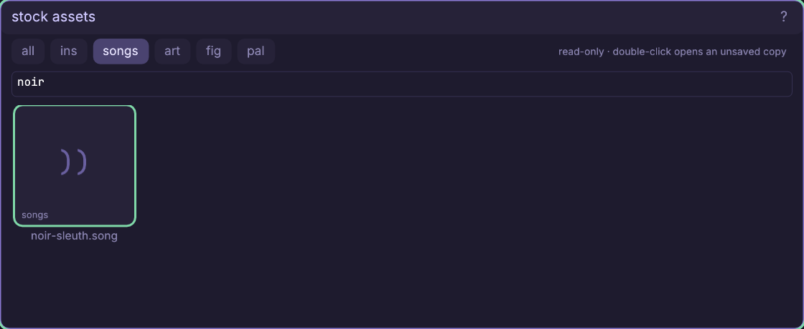
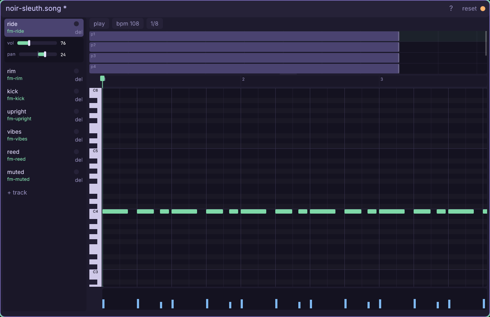

# The stock assets window

Treat the engine's library as a parts shop: audition immutable originals,
open disposable working copies, then keep only the pieces your project owns.

Every control and copy rule: [the Stock reference](engine/stock/docs/ref-stock.md) —
all five families, filtering, previews, the open/copy/drag doors, naming, and
what does or does not travel with an asset.

## Walkthrough: borrow a noir cue and make it yours

This is the second half of
[the Assets tutorial](engine/stock/docs/win-assets.md). It builds a tiny audio
kit beside `art/characters/moonrunner.spr`: a saved song named
`sound/moonlit-route.song` and a local glass voice named
`ins/moon-glass.ins`. The source library remains byte-for-byte untouched.

1. Right-click empty canvas and choose **stock assets**. The caption says
   **read-only** because this window has no rename, delete, or save surface.
   Its family chips are **all, ins, songs, art, fig, pal**; the small tag in
   each tile repeats the family so color is never the only cue.
2. Click **songs**, type `noir` in **fuzzy search**, and left-click the one
   result, `noir-sleuth.song`. The grid searches stock names, not your project,
   and the selected outline means the next `c`, Enter, double-click, or drag
   has an exact source.

3. Double-click `noir-sleuth.song`. A music window opens beside Stock as
   `sound/noir-sleuth.song *`: the bytes are in editor working state under an
   available project name, but there is no project file yet. The amber dot and
   trailing `*` are the non-color-only promise that this is an **unsaved copy**.

4. Press **space** to audition the arrangement; press it again to stop. Browse
   its clips if you like, then press **ctrl+s**. Only now does
   `sound/noir-sleuth.song` appear on disk. Return to Assets, choose **sound**,
   filter `noir`, press **r**, and move it to `sound/moonlit-route.song`.
   The open music window follows the new name.
5. Return to Stock, choose **ins**, and filter `fm-glass`. Left-click the tile
   and press **c**. This is the other adoption door: it writes an immediate,
   byte-identical `ins/fm-glass.ins`, refreshes Assets, and marks that tile for
   its green arrival flash. Use this door when you already know you want the
   original unchanged.
6. In Assets choose **sound** and filter `fm-glass`. Double-click the project
   tile: its synth window opens clean because the direct copy is already saved.
   Hold **z** to audition the bell-like voice. Click its Assets tile once,
   press **r**, and rename it `ins/moon-glass.ins`; the synth window follows.
7. Filter Assets for `moon-glass`, then press-drag that `.ins` tile onto the
   first track row in `moonlit-route.song`. The row outlines before release.
   Its instrument label changes from the stock `fm-ride` reference to the
   project-local `moon-glass`, and the song becomes dirty.
8. Press **ctrl+s** in the music window. The adopted kit is now explicit:

       art/characters/moonrunner.spr    character source + baked family
       sound/moonlit-route.song         project-owned arrangement
         -> ins/moon-glass.ins          project-local track voice

9. The safe experiment pattern is now yours: **double-click** when you want an
   unsaved sandbox, **c / enter** when you want an exact file immediately, and
   **drag** when a receiving well or track should decide how to adopt it. Name
   the result for its role before game code starts depending on the path.

The copied song's untouched tracks may still name `engine/stock/ins/...`.
Those references are valid because the stock library ships with the engine;
replace only the voices you intend to own and edit locally.

Full reference: [every Stock control](engine/stock/docs/ref-stock.md),
[the Assets browser](engine/stock/docs/ref-assets.md),
[the music window](engine/stock/docs/win-music.md), and
[the synth](engine/stock/docs/ref-synth.md).
