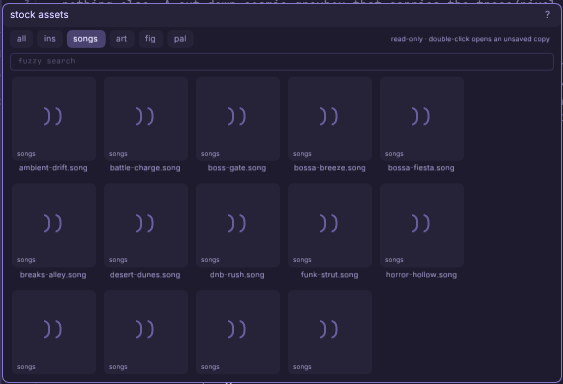

# The stock assets window

Everything the engine ships in the box — instruments, demo songs, sprites,
figures, palettes — in one read-only browser. Nothing here can be edited or
deleted in place; every door pulls a copy INTO your project.

## The doors

- **double-click** opens an *unsaved copy*: the stock bytes open in the right
  editor window under a fresh auto-generated project name, already marked
  unsaved. Play with it freely — **ctrl+s** keeps it in your project; closing
  the window without saving leaves your project untouched.
- **c** (or **enter**) copies the selected asset into your project directly
  (instruments land in `ins/`, songs in `sound/`, art in `art/`, palettes in
  `pal/`). The assets browser flashes the new file.
- **drag** an asset onto a window that accepts it — a music track binds a
  dragged instrument (copying it in on the way), the sprite editor's stamp
  well takes a dragged image.

## What ships

- **ins** — the FM/gameboy/sfx instrument presets (the synth window's preset
  rail lists these too). Families cover the common vibes: orchestral
  (strings, choir, harp, flute, reed, timpani, orchestra hit, harpsichord,
  music box), jazz/latin/funk (nylon, upright, vibes, muted trumpet, clav,
  slap, cowbell), electronic (sub, reese, ride, shaker, rim, conga), and
  ambient/spooky (drone, glass).
- **songs** — demo tracks smoke-testing those presets: desert, water,
  a minuet, a soft prelude, battle, final boss, drum-n-bass, breakbeat,
  two bossa novas, funk, a detective swing, horror, and slow ambient.
  Open one unsaved and drill into its patterns to see how it's built —
  they make good starting points.
- **art / fig / pal** — the stock tileset, the mascot figure, and the
  shipped palettes.

## Walkthrough: borrow a groove without risking the original

1. Choose **songs**, filter for a mood, and double-click one. It opens as an
   unsaved project copy — press Space, click its clips, and inspect how short
   patterns become a longer arrangement.
2. Delete a lead clip, lower one track, and drag a different stock instrument
   onto that lane. The stock source remains unchanged, so experimentation is
   free.
3. **Ctrl+S** only when the direction works. The generated project path becomes
   your own song and every borrowed instrument is copied into the project.
4. Return here, choose **ins**, and press **c** on one contrasting voice. Open
   it in the synth, bend its envelope/filter, save under a clear name, then
   replace one more track. You now have a derived arrangement rather than an
   opaque demo file.

## Keys

- **c** copy the selection into the project · **enter** same
- **ctrl+wheel** dials the preview tile size · type in the filter to
  fuzzy-find · the chips filter by family

Full reference: [The assets browser](engine/stock/docs/win-assets.md),
[the synth](engine/stock/docs/win-synth.md), and
[the music tracker](engine/stock/docs/win-music.md).
