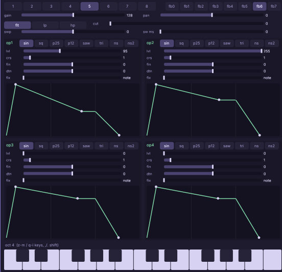
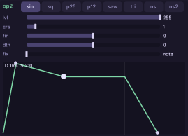
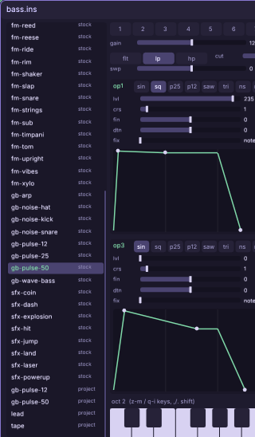
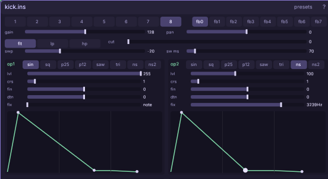

# The synth (instrument designer)

Design an instrument (`.ins`): a 4-operator FM voice (with pulse and Game Boy
noise waveforms) or a sampler. Drop it on a music track, or play it from code.

Every knob and button: [the synth reference](engine/stock/docs/ref-synth.md) —
including how all 53 stock presets were built, family by family.

## Walkthrough: a four-sound chip kit

One session, four instruments — a lead, a bass, a kick, and a jump
sound: the smallest set that makes a game *sound like a game*. Along
the way you'll touch every part of the window once. Keep a note held
while you drag things — every edit is live.

### The lead — meet FM with your ears

1. **Right-click empty canvas** and pick **synth**. The unbound window
   is the new-instrument door: type `ins/lead.ins` and press
   **enter**. You get the starter patch — two sine operators, op1
   quietly bending op2 — on algorithm chip **5** (two independent
   pairs; op3/op4 sit at lvl 0, off).
2. Hold **z** (or click and hold a piano key at the bottom). A soft
   tone. Now, while re-tapping **z**, drag **op1's lvl slider** slowly
   up from 70 toward 130 and listen: the tone *brightens* — more
   modulator level = more harmonics. That one drag is FM synthesis.
   Settle around **95**.
3. Click the **fb6** chip (top right row). Feedback makes op1 gnaw on
   itself — the pair grows teeth. This is the stock `fm-lead` sound,
   and you just rebuilt it.
4. Shape the envelopes on the two **ADSR graphs** (op1 and op2): grab
   the middle handle of op2's graph and drag it *up* (sustain ~210,
   the note holds strong), and give op1 a little decay slide down to
   sustain ~180 — the brightness softens as the note rings, like a
   real plucked-then-held string. A readout shows values while you
   drag.

5. **ctrl+s**. First instrument done. (Every finished gesture is one
   undo step — **ctrl+z** walks back a bad drag; **esc** silences
   anything ringing.)

### The bass — start from a preset

6. Right-click the canvas, spawn another **synth**, type
   `ins/bass.ins`, enter. Click the **presets** header chip: the rail
   lists all stock instruments plus your project's own (your
   `lead` is already in it, labeled `project`). Wheel-scroll to the
   `gb-` family and click **gb-pulse-50** — a pure Game Boy square
   loads into *your* file (the name stays `bass`; the loaded row stays
   marked so you don't lose your place).

7. Press **,** twice to drop the audition two octaves and hold **z** —
   that's the chip-bass register. Round it off: set **flt** to `lp`
   and pull **cut** down to ~110 until the buzz sits back. Fatten it:
   op1's **dtn** a nudge off zero against a second op if you're
   feeling brave (the reference's ensemble recipes), or leave it pure
   GB. **ctrl+s**.

### The kick — fixed frequencies and the sweep

8. Third synth window: `ins/kick.ins`. Click algorithm chip **8** (no
   modulation — ops mix straight out). On **op1**: leave sine, lvl
   **255**, and on its ADSR pull sustain to **0** with decay ~180 ms
   and a short release — a dead thud. Now the magic: set **swp** to
   **−20** and **sw ms** to **70**. Play a key: the pitch dives 20
   semitones in 70 ms — that dive *is* a kick drum.
9. Give it a beater: on **op2** pick the **ns** wave, lvl ~100, drag
   its **fix** slider until the readout says ~**3200Hz**, and make its
   envelope a 30 ms tick (sustain 0). The noise now ignores the
   keyboard — play the kick up and down the keys and the *thump*
   changes pitch while the *click* stays put. That's what fixed
   frequency is for; the body of the stock `fm-kick` adds one more
   sine fixed at 120 Hz the same way.

### The jump — bend an sfx preset

10. Fourth window: `ins/jump.ins`. Open **presets**, click
   **sfx-jump** (a pulse25 chirping *up* +14 semitones in 90 ms —
   the mirror image of your kick). Bend it yours: push **swp** to
   +19 for more cartoon, or stretch **sw ms** toward 150 for a
   floatier arc. **ctrl+s**.

### Use the kit

11. Drag any of the four from the presets rail (or an assets window)
   onto a music window's track rail — the note roll now plays your
   instrument ([the music window](engine/stock/docs/win-music.md)).
   From game code, upload and trigger them with `cm.ins` + `cm.snd`
   — the copyable four-liner is in the scripting guide's sound
   section.

Where next: the reference's **preset recipes** section reverse-
engineers every stock family — bells, strings, the whole drum kit —
into the same handful of knobs you just used.

## Keys

- **the tracker-key rows** play notes (like a chip tracker keyboard):
  **z**-row = the low octave, **q**-row = the octave above
- **, / .** octave down / up
- **esc** silences held notes · **ctrl+z / ctrl+y** undo / redo · **ctrl+s** save

## Presets

The preset strip carries the stock instruments (the Game Boy family, the FM
family, the sfx family) and your project's `ins/` folder. Click one to load it
into the synth; **drag** one onto a music track to bind it there. Stock
presets copy into your project's `ins/` so the song stays self-contained.

Full reference: [every knob and button](engine/stock/docs/ref-synth.md),
[the music window](engine/stock/docs/win-music.md), and
[sound in game code](engine/stock/docs/scripting.md#sound-effects-and-music-cmsnd-cmins).
