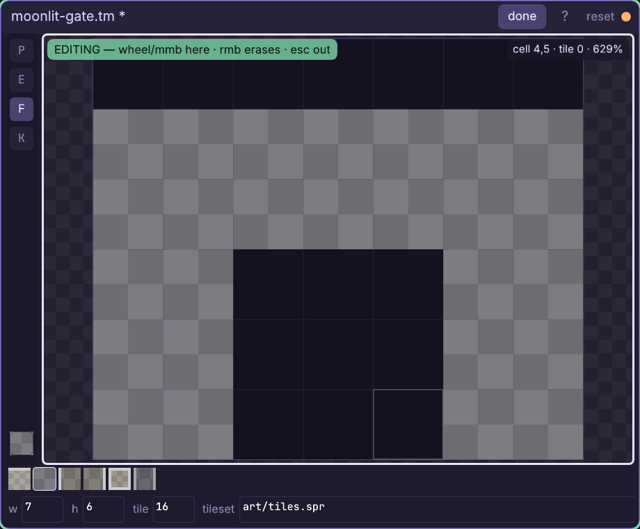
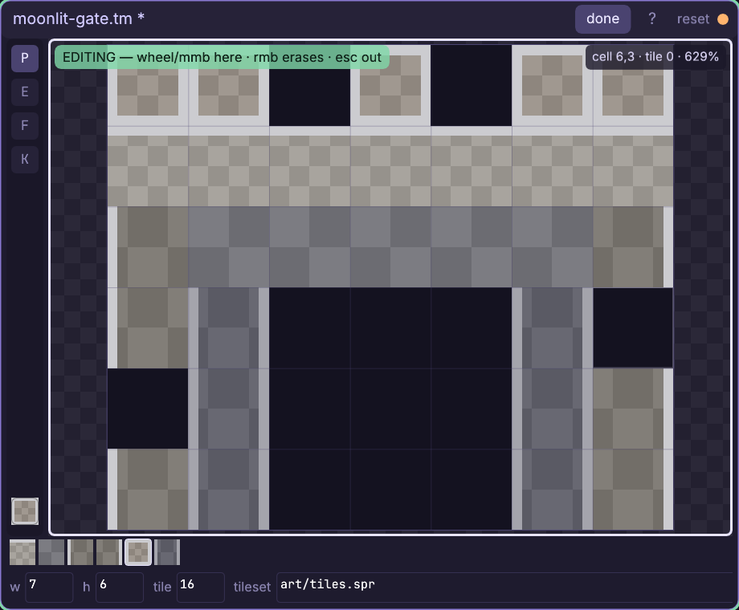
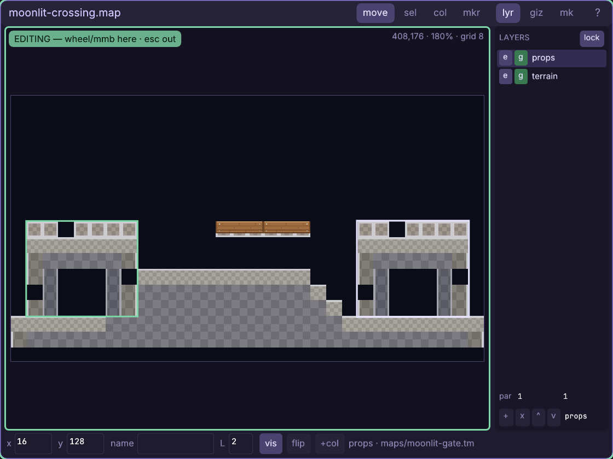

# The tilemap window

Paint one small tile grid once, then reuse it as a single visual object across
your maps.

Every control and gesture: [the tilemap reference](engine/stock/docs/ref-tmap.md) —
tools, mouse buttons, palette, fields, view lock, files, maps, and the CTLM format.

## Walkthrough: build the Moonlit Gate

This lesson makes `maps/moonlit-gate.tm`, a broken seven-by-six ruin with an
open doorway. You will block in its mass, carve with the right button, dress
the edges with six stock tiles, save it, and place the same asset at both ends
of the Moonlit Crossing map from the previous lesson. One final edit will then
update both gates together: that is the reason to use a tilemap chunk instead
of forty-two loose sprite placements.

The exact path uses the bundled **smoke** project after
[the Map tutorial](engine/stock/docs/win-map.md), so
`maps/moonlit-crossing.map` and `art/tiles.spr` already exist. In another
project, copy the stock **tiles** sprite from Stock's Art family first, then use
your own map and positions. The stock strip has six 16px frames, left to right:
top, interior, left edge, right edge, lone slab, and pillar.

1. Right-click empty canvas and choose **tilemap**. Replace the suggested name
   with `maps/moonlit-gate.tm` and press Enter. The new asset opens in edit mode
   as an empty 16x16-cell grid. It is working state already, but it does not
   exist on disk until the first save.
2. Set the bottom fields to **w 7**, **h 6**, **tile 16**, and
   **tileset `art/tiles.spr`**, pressing Enter after every changed field. Width
   and height are cells; tile is the size of each square in map pixels. The six
   frames appear in the palette strip. If the canvas says the strip is
   unreadable, fix the tileset path before painting.
3. Enter left the new window focused. The green **EDITING** banner means it now
   owns wheel zoom and middle-drag pan; **shift+1** refits it and Esc releases
   the view. If you need to refocus, click its title or a palette swatch — not a
   grid cell, because the Pen is already live. Move over the grid and watch the
   top-right bay: it reports `cell x,y`, the tile id already stored there, and
   zoom. Cell `(0,0)` is the top-left, and empty is tile `0`.
4. Select the second palette swatch, **interior**, and press **f** for the
   rectangular fill tool. Left-drag from cell `(0,1)` to `(6,5)`. Five solid
   rows appear in one gesture and therefore one undo step; row 0 remains empty
   for the broken crest.
5. Keep **F** active and right-drag from `(2,3)` to `(4,5)`. The right button
   uses the current tool's shape as an eraser, so one rectangle cuts a
   three-by-three doorway without a trip to the eraser tool.

6. Dress the silhouette with **P**. Select tile 1, **top**, and drag across
   `(0,1)` through `(6,1)`. Select tile 3, **left edge**, and drag from `(0,2)`
   to `(0,5)`; select tile 4, **right edge**, and drag `(6,2)` to `(6,5)`.
   Palette ids are one-based from left to right, exactly like sprite frames.
7. Select tile 6, **pillar**, and paint the doorway jambs from `(1,3)` to
   `(1,5)`, then `(5,3)` to `(5,5)`. Select tile 5, **lone slab**, and click
   `(0,0)`, `(1,0)`, `(5,0)`, and `(6,0)` for a ragged cap.
8. Deliberately choose tile 1 in the palette, press **k**, and click the cap at
   `(0,0)`. The current-tile well and readout recover tile 5 from the art
   itself. Press **p** and put that picked slab at `(3,0)` as the keystone.
   Pick ignores empty cells, so clicking the doorway would leave tile 5 armed.
9. Make the wall old. Press **e** and click `(0,4)` to remove one left-edge
   block. Press **p**, then right-click `(6,3)` to chip the other side without
   changing tools. Try **ctrl+z**, then **ctrl+y**: the last chip disappears and
   returns as one journal entry.

10. Press **ctrl+s**. The title's amber dot and trailing `*` clear, the CTLM
   source publishes atomically, and every open map or running game is told to
   refresh this visual asset. Click **done** to see the transparent 112x96px
   chunk aspect-fit; **edit** returns to the cell tools.
11. Open **Assets**, filter `moonlit-crossing`, and double-click the `.map` —
   not its `_gb.tm` companion. Leave its top `props` layer active. Now filter
   `moonlit-gate`, hold Ctrl, and drag the tilemap onto the Map view with the
   pointer at `(72,176)`. Its 112x96px ghost lands at `(16,128)`, framing the
   west-bank spawn. A `.tm` drops as one placement, not forty-two map items.
12. The new gate is selected. Press **ctrl+d** once; the duplicate begins one
   map-grid step down and right. In its bottom inspector set **x** to `352`
   and **y** to `128`. Both placements reference the same
   `maps/moonlit-gate.tm`; neither stores a private copy. Turn **giz** and
   **mk** off for a clean art check, then **ctrl+s** the map.
13. Turn the layer panel's **lock** on so the full-map graybox beneath the art
   cannot join the click drill, then double-click either gate in **move** mode.
   If the new Tilemap window is off screen, Ctrl+Tab focuses and reveals it.
   Click **edit**, press **k**, sample the keystone at `(3,0)`, press **p**, and
   add a slab at `(4,0)`. Save the tilemap and return to Map: both gates grow
   the new cap immediately, while the saved map stays clean because its two
   placement records did not change.

You now have the reusable-chunk loop: edit cells in Tilemap, save once, and
every placement refreshes. Move, layer, duplicate, or delete each map
placement independently; edit the shared pattern here.

## Collision still belongs to the map

A tile id means visible artwork, never solidity. Moonlit Crossing remains
walkable because its collider chain already owns the banks under both gates.
For a new wall, switch the Map window to **col**, choose **line**, hold Ctrl,
and hover an exposed edge of the placed tilemap. The edge-run preview expands
across the contiguous solid cells; one click lays that whole collider segment.
Changing the art later does not silently rewrite gameplay geometry.

Game code normally needs no tilemap call at all. A `.tm` is a map placement,
so the same draw used in the Map lesson renders both copies:

    local map = cm.require("cm.map")

    function game.draw()
      map.draw_fill(room, camera.x, camera.y)
      map.draw_places(room, camera.x, camera.y)
    end

Use `cm.tmap` directly only when you generate grids or draw one outside a map.

Full reference: [every Tilemap control and file rule](engine/stock/docs/ref-tmap.md),
[the Map tutorial](engine/stock/docs/win-map.md),
[the Map reference](engine/stock/docs/ref-map.md), and
[tilemaps in game code](engine/stock/docs/scripting.md#tilemaps-cmtmap).
